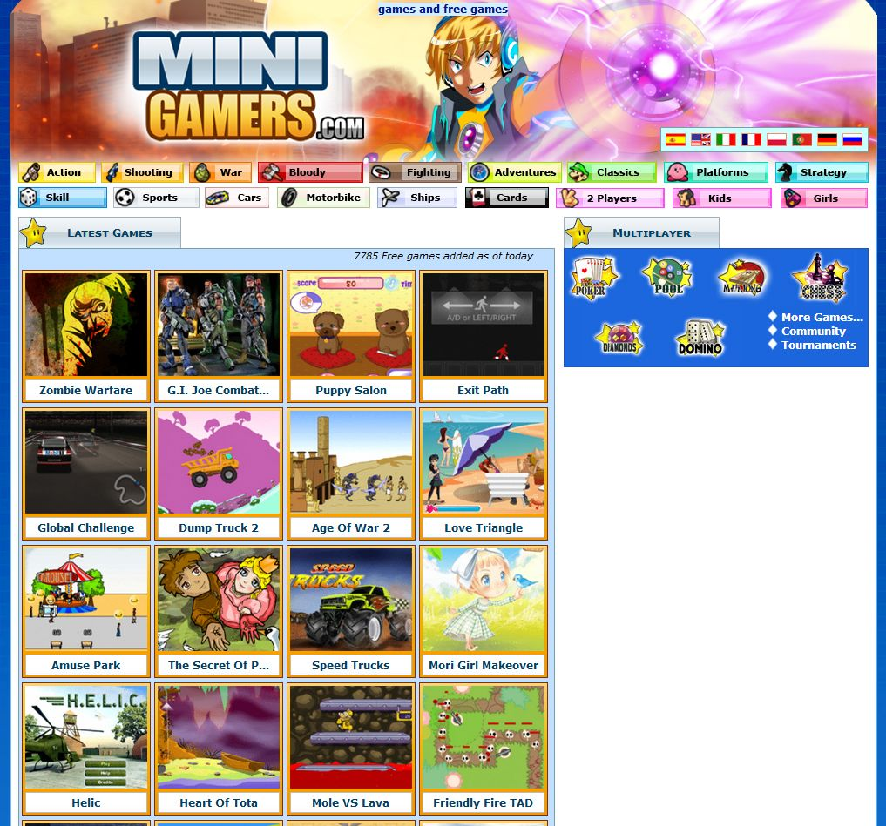

#Maquetación re-diseño a modo de upgrade en macrojuegos.com
Fuí contratado por Panaworld S.L a tiempo parcial para realizar tareas de soporte, maquetación frontend, HTML, CSS y en principio poco más. Mi primer trabajo con esta empresa consistió en maquetar un rediseño del producto principal de la empresa, macrojuegos.com.

El trabajo consistía en maquetar mediante HTML y CSS2.5 dando soporte a navegadores como Internet Explorer 6, 7, 8, Mozilla Firefox y el recien creado Google Chrome. El diseño fué creado por un diseñador profesional con Adobe Photoshop, del cual me debí basar para la maquetación.

Este fué mi primer trabajo oficial como programador, aunque realmente... maquetar no es programar. La página a diseñar era un sitio web sobre videojuegos de navegador, con bastante tráfico. Además, tenía soporte a múltiples idiomas, aunque ello no fué ningún condicionante a la hora de maquetar.

Una vez implementado se publicó solamente en las páginas de idiomas inglés, ruso y polaco minigamers.com macrogames.ru microgry.com ya que estos dominios no tenían tanto tráfico y nos servían como proyecto piloto.

*Uno de tantos diseños que tuvo minigamers.com*

Maquetar hoy día puede parecer sencillo, sin embargo, en la época del Internet Explorer 6 (navegador con una cuota de mercado todavía muy alta) era una tarea que podía generar auténticos dolores de cabeza, ya que, tu utilizabas las reglas CSS oficiales siguiendo los manuales, pero el navegador respondía como quería a estas, convirtiéndose en una pesadilla. Afortunadamente con los años los usuarios dejaron de utilizar Internet Explorer y hoy día la cuota de mercado la amasa Chrome.