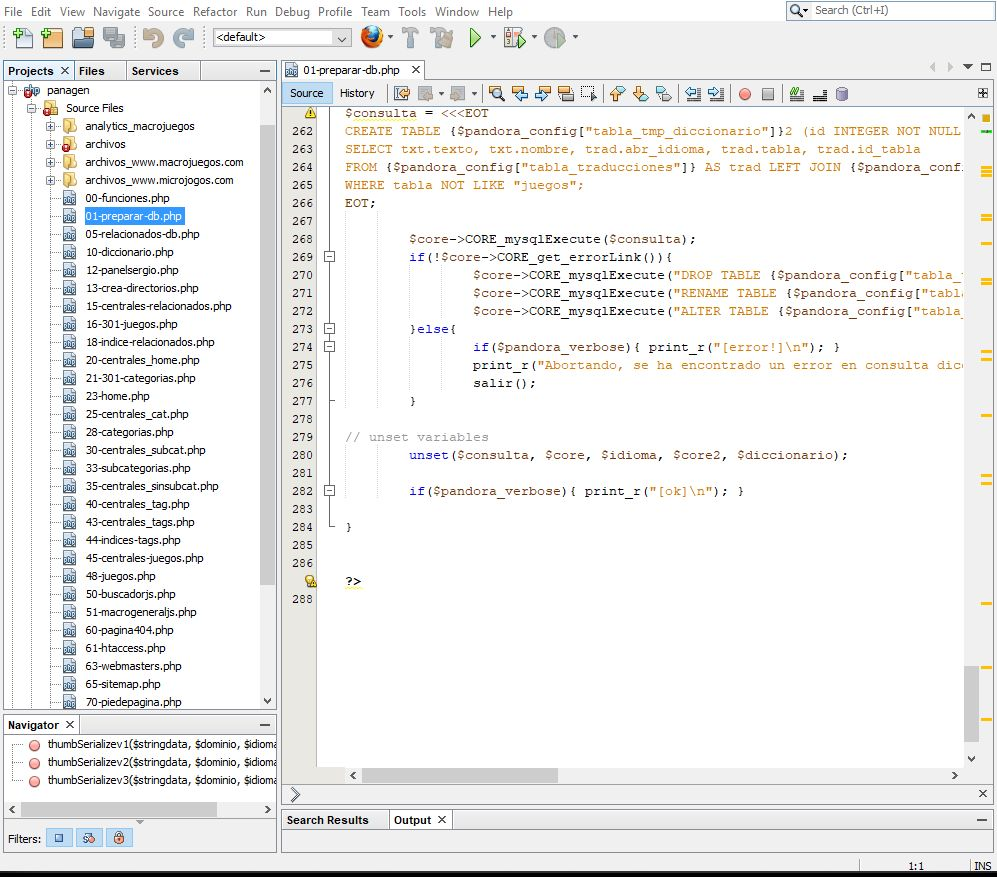

# Reducing building time of Panagen

A team of developers from Panaworld created their own solution using the PHP language. This software was a tool for building heavy static sites at _compile time_, reducing the costs of having a lot of _execution time_ load in production machines.

This software was still Beta. It was used for a secondary product of the company. They asked me to debug and optimize all the aspects of the code: Algorithms, unnecessary loops, SQL queries...

*Panagen root folder*

In addition to removing unnecesary loops and improving sql queries... the greatest performance improvement I achieved was creating the proper SQL Indexes and adapting the queries helping the storage engine to use them.

Prior to optimization, Panagen took almost one hour in order to build 8 different websites, including the deploy time. After my work was done this task only took 15 minutes.