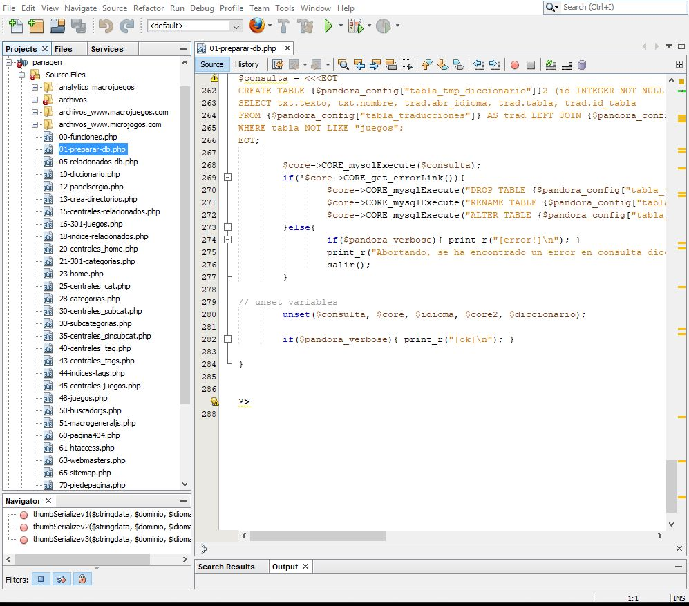

#Reduciendo el tiempo de generación de Panagen
El equipo de desarrolladores de Panaworld creó un software propio mediante el lenguaje PHP. Este software tenía como finalidad la pre-generación de cientos de miles de páginas estáticas, para así reducir con ello el coste de servidores en tiempo de ejecución o producción.

Este software todavía estaba en fase beta. Estaba siendo utilizado para un producto secundario de la empresa. Se me encomendó la tarea de depurar y optimizar todo tipo de aspectos del código: Algoritmos utilizados, bucles innecesarios, consultas SQL...

*Directorio raíz de Panagen*

Además de eliminar algunos bucles con consultas innecesarias que se podían hacer en una sola consulta, la mayor mejora de rendimiento la conseguí creando Índices de MySQL y adaptando las consultas para que así el engine pudiera utilizarlos.

Previo a la optimización, Panagen tardaba casi una hora en generar páginas estáticas de 8 sitios web diferentes, incluido también el tiempo de despliegue a producción. Después de la optimización esto tan solo tomaba 15 minutos.