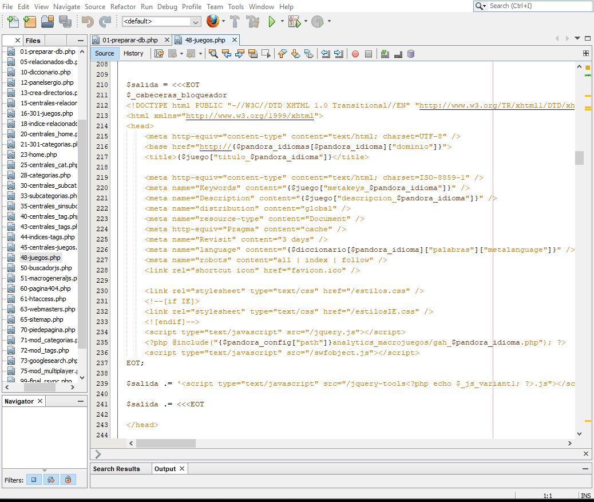

# Upgrading legacy code from main product line to the new Panagen engine

The company Panaworld was born thanks to his CEO, [Sergio Fernández](https://es.linkedin.com/in/sergio-fernandez-giribets-25805717 "Panaworld's CEO LinkedIn"), by the year 2005. He managed to develop the php code with a little help from other developers he knew. He wasn't a software developer.

This code (and he admitted it) was written very badly: No standards, no comments, bad naming, no reusability, lack of structure... it was very hard to maintain this code. We found ugly variable names within this code like `$hello = mysql_connect()`, awful. Regardless of that, this code worked perfectly. It built all the static pages from the sites without problems. Thanks to the efforts from Sergio, in a time where there wasn't enough competition for the browser games market, the websites microgiochi.com macrojuegos.com microjeux.com microjogos.com earned a good amount of traffic, being the first one the site with better SERP positions in Google.

As expected, the developer team couldn't make use of this bad written legacy code. In order to keep updating the products and taking advantage of that we already built a new Engine for build static sites, I was entrusted the task of rewriting the php code entirely, making the necessary changes without changing the built output, so this way I couldn't alter the SEO of the products.

*Example code using template strings for html*

Creating sites with the Panagen engine, in addition to follow the docs for multilanguage and url configurations, used a lot of template string using php in order to create the variable HTML output. Also, I had to change all the SQL queries, because they also changed (other developers) the internal database for scalability.

*Example code, generating sitemaps with Panagen*
