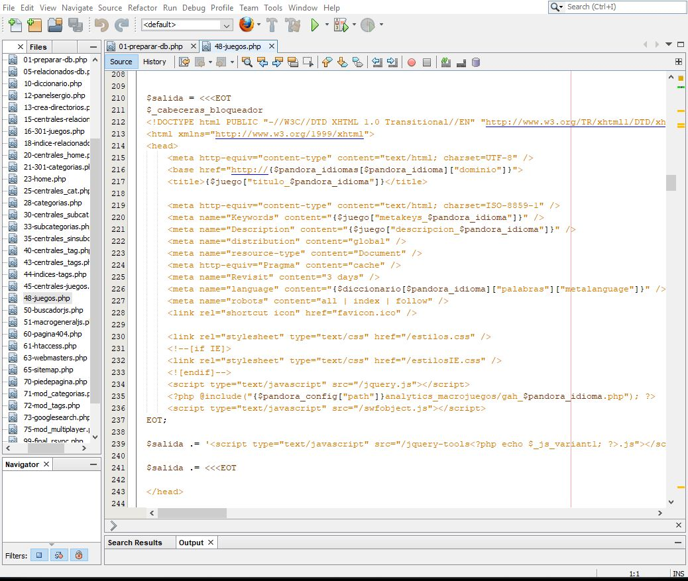
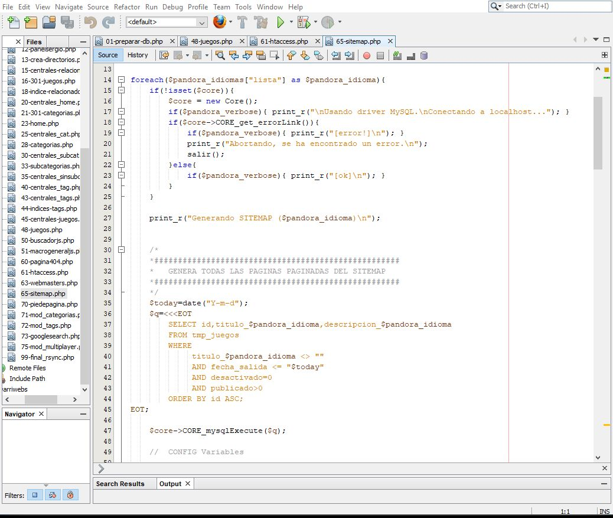

# Adaptando código antiguo al nuevo motor Panagen

La empresa Panaworld nació gracias a que su CEO, [Sergio Fernández](https://es.linkedin.com/in/sergio-fernandez-giribets-25805717 "LinkedIn del CEO de Panaworld"), sobre el año 2005, consiguió programar este código PHP con la ayuda de algunos conocidos que sabían programar, ya que él no era programador.

El código (y sergio lo admitió) vulneraba todos los estándares de como se debe escribir un buen código: No era un código eficiente, no estaba bien estructurado, no tenía buena legibilidad, no permitía hacer modificaciones facilmente, etc. Podíamos encontrar en este código nombres de variables tal que `$hola = mysql_connect()`, terrible. A pesar de todo el código cumplía su función y era capaz de generar todas las páginas estáticas. Gracias a que Sergio se esforzó en hacer esto, en una época donde había poca competencia en el sector de juegos de navegador, los sitios web microgiochi.com macrojuegos.com microjeux.com microjogos.com lograron buenos niveles de tráfico, siendo el primer dominio el producto mejor posicionado en Google.

Como era de esperar, los desarrolladores practicamente no podíamos meter mano a ese código tan mal escrito. Para poder seguir actualizando los productos, y aprovechando que otros desarrolladores de Panaworld crearon el motor de generación de webs estáticas Panagen, se me encomendó la tarea de rehacer por completo todo el código PHP del sistema, realizando todos los cambios que fueran necesarios, siempre y cuando las páginas estáticas generadas fuesen exactamente las mismas, para no alterar ningún aspecto del SEO del producto.

*Ejemplo de uso de template strings*

La implementación con Panagen, además de seguir la documentación propia de este para todas las configuraciones de idiomas y urls, hacía mucho uso de los template strings de PHP, manejando así las plantillas de HTML para generar con variables todas las diferencias entre páginas. También había que cambiar las consultas SQL, ya que se cambió también la base de datos por que la antigua era poco escalable.

*Código para generar sitemap en Panagen*

