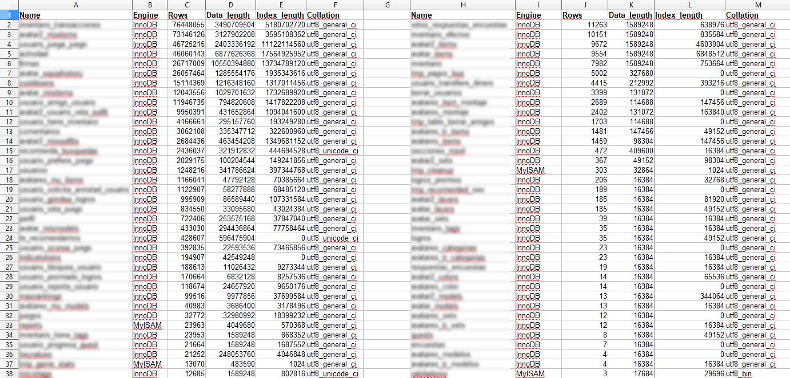

# Diseñar y crear el Schema de una base de datos Social

En Panaworld querían expandir los sitios web. Inicialmente solo eran páginas estáticas que albergaban mini juegos de navegador. La visión de futuro de la empresa era la de crear una comunidad de usuarios, donde estos pudieran comunicarse mientras jugaban a los juegos. Se requería diseñar y crear el schema de una base de datos MySQL para poder tener las siguientes características en el sitio web:

* Registro y login de usuarios
* Cambios de contraseña
* Comentarios en juegos
* Comentarios en perfiles de usuario
* A que juegos juegan los usuarios
* Poder dar like y dislike en los juegos
* Poder marcar juegos como favoritos
* Actividad (sistema de notificaciones)
* Datos de perfil
* Datos para avatar en perfil
* Sistema de amistad entre dos usuarios
* Solicitudes de amistad
* Bloquear usuarios
* Reportar usuarios
* Ranking de mejores usuarios
* Sistema de logros
* Juegos recomendados para cada usuario

Estas eran las características sociales, pero además había que soportar las básicas que anteriormente se generaban de forma estática desde otras bases de datos generales, eran las siguientes:

* Información sobre los juegos
* Tags en los juegos
* Categorías y Subcategorías

Al crear esta base de datos se tuvo que tener en cuenta como serían las consultas SQL del backend de la web, para poder crear así unos indices eficientes, ya que estas tablas seguramente albergarían millones de filas con los años. En principio opté por un modelo de datos normalizado relacional con claves foráneas, para tener un mayor control de la información en el futuro.

*Diagrama EER de la base de datos*
`youtube:https://www.youtube.com/embed/8oq4M0E0cyE`

Con permiso de Panaworld y censurando los nombres de tablas por seguridad, he preparado una hoja de cálculo donde se puede ver la información estadística del uso de esta base de datos a día de hoy. Como se puede comprobar en la columna `Rows` o `data_length` algunas tablas son muy grandes y nunca nos han dado problemas de lentitud, ya que los indices los hice con esto en mente. El único problema es que los indices gastan espacio en disco y necesitas escalar añadiendo más espacio en disco, o borrando datos innecesarios en mantenimientos.

*Información del servidor de producción sobre esta base de datos*

En el momento que leas esto no se si todavía estará en funcionamiento el sitio web (espero que si), pero todas las características que se utilizaron por medio de esta base de datos las puedes encontrar en la web [macrojuegos.com](http://www.macrojuegos.com "Sitio web que alberga esta base de datos") y también en los sitios web `microgiochi.com minigamers.com microjeux.com macrogames.ru microspiele.com microgry.com microjogos.com` que utilizaban la misma base de datos pero en diferentes idiomas.