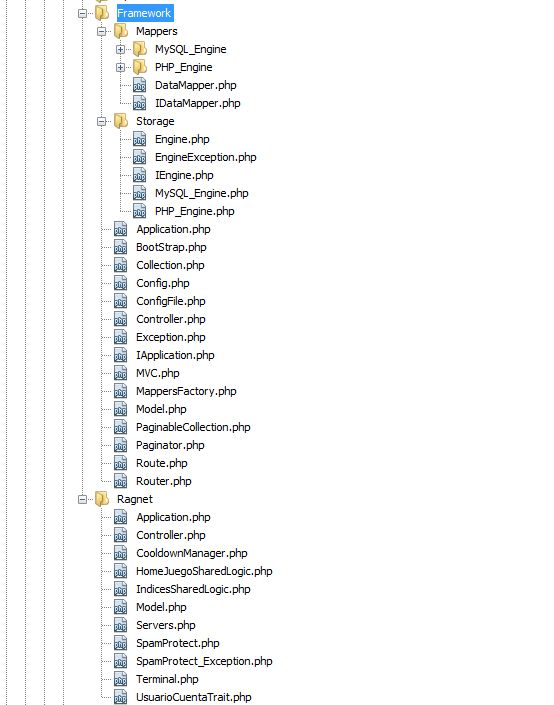
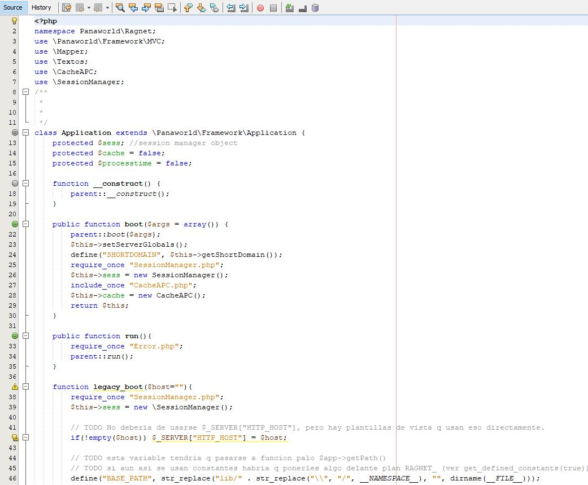
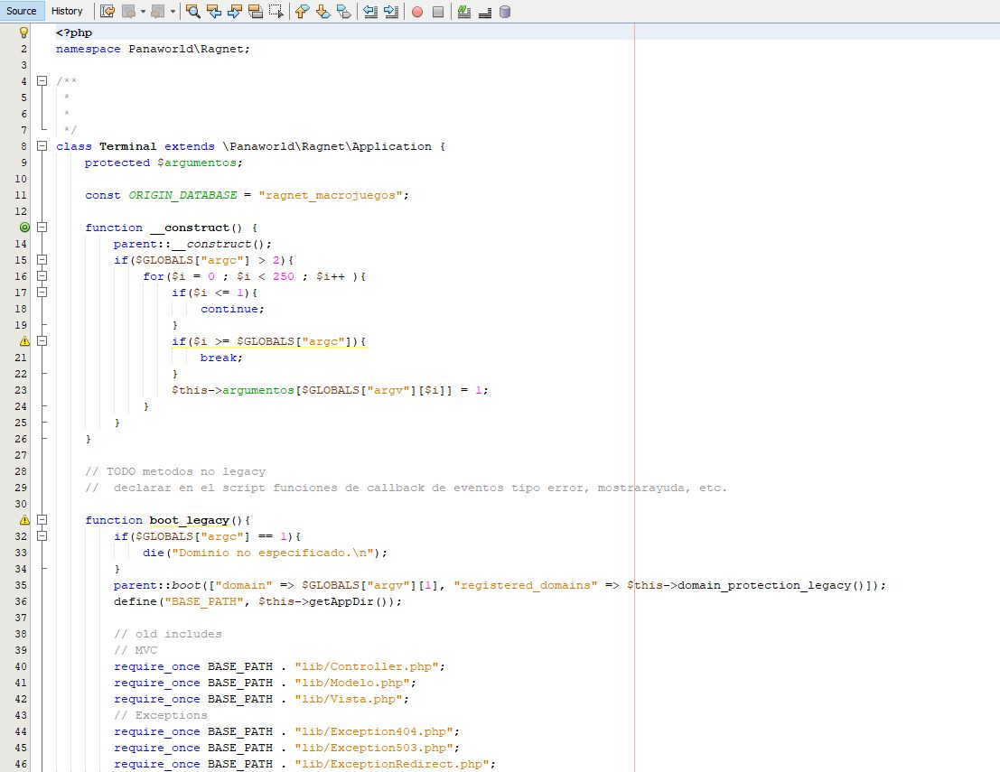

# Developing a custom PHP Framework MVC based

The Company Panaworld was thinking about the new times and decided to abandon the old model of building static sites. The idea was to start building 2.0 websites where the users could interact and have social media features. This required a new model of work in the company. In the past, we used our tool [Panagen](/en/projects/improving-panagen-performance/) and it was fine but now we required something else.

In 2010 there wasn't many frameworks like today, so we decided to create our own PHP framework, minimalistic and MVC model view controller based. The basic features it had:

* Bootstraping all the requests from the webserver into an entrypoint.
* Router system in order to send the url requests to their proper controller, or the 404 controller.
* Classes/objects for managing the database STORAGE.
* REST API support.
* Multilanguage support.
* Caching system in memory or disk in order to cache db queries.
* Executing an internal route from the terminal.
* Classes/objects in order to manage pagination.
* Classes/objects in order to manage the separation of concerns MVC.
* Classes/objects in order to manage the controllers.
* Classes/objects in order to manage the views.

And... more things, like adding analytics with ease, compress html, configuring load servers, etc. Everything that could be reusable and useful for the other sites.

*Some PHP classes involved on this project*

*Demo code app class*

*Demo code Terminal class*

The development process of this framework was done using _Pair Programming_ so two people at the same time were involved. I have to say that it was very nice to work and try _Pair Programming_, it's a recommended way for building critical things that could break with ease. The ideas and decisions flowed fast, the stupid mistakes were spotted at the moment so there was almost no bugs in this code. It felt so productive!