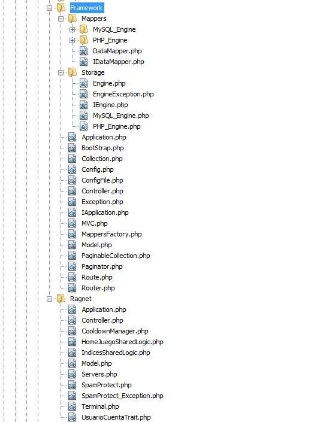

# Desarrollo de un Framework privado con PHP

La empresa Panaworld con la idea de adaptarse a los nuevos tiempos decidió abandonar el modelo antiguo de páginas web estáticas y empezar a crear sitios web 2.0 donde los usuarios pudieran interaccionar y guardar su información. Esto requería un nuevo modelo de trabajo en la empresa, ya que hasta ahora todo funcionaba gracias a la herramienta para generar páginas estáticas [Panagen](/proyectos/optimizacion-rendimiento-panagen/), que también se creó en la empresa.

En una época donde no era tan normal disponer de Frameworks públicos y gratuitos, los desarrolladores web de la empresa nos reunimos y decidimos crear un framework PHP propio, minimalista y basado en MVC model view controller. Las características básicas que tendría serían:

* Bootstraping de todas las peticiones del "webserver" hacia un punto de entrada.
* Sistema router para enviar las diferentes peticiones de url a cada controlador, o al controlador 404.
* Conjunto de clases de STORAGE para interaccionar con la base de datos.
* Soporte REST API.
* Soporte a múltiples idiomas.
* Sistema para cachear consultas de base de datos en disco o en memoria.
* Capacidad de ejecución de rutas web vía terminal.
* Conjunto de clases para crear paginaciones facilmente.
* Conjunto de clases para llevar a cabo la separación del código MVC.
* Conjunto de clases para gestionar los controladores.
* Conjunto de clases para gestionar la vista.

Y otras cositas más como poder agregar analytics facilmente, comprimir código html, configuración de servers de carga y otras lindezas, en definitiva cualquier plugin reusable en otras web de la empresa.

*Algunas de las clases creadas para hacerlo funcionar*

*Código demo App class*

*Código demo Terminal class*

La labor de desarrollo de este framework se realizo en forma de _Pair Programming_ que viene a ser dos desarrolladores trabajando un mismo sitio, vamos, que el projecto lo hicimos entre dos personas. He de decir a término personal que para algunas cosas críticas como lo es crear el core, la base de un proyecto o un framework, es bastante recomendable hacerlo mediante _Pair Programming_. Las ideas y la toma de decisiones fluyeron rapidamente, los errores tontos propios del desarrollo se iban subsanando sobre la marcha y en general la sensación de productividad era muy grande.