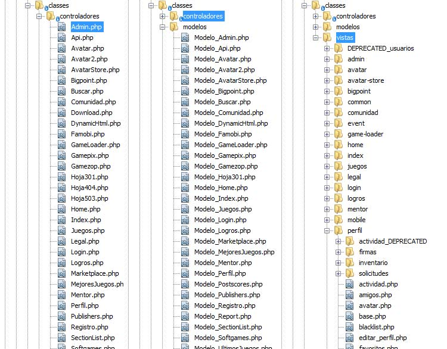
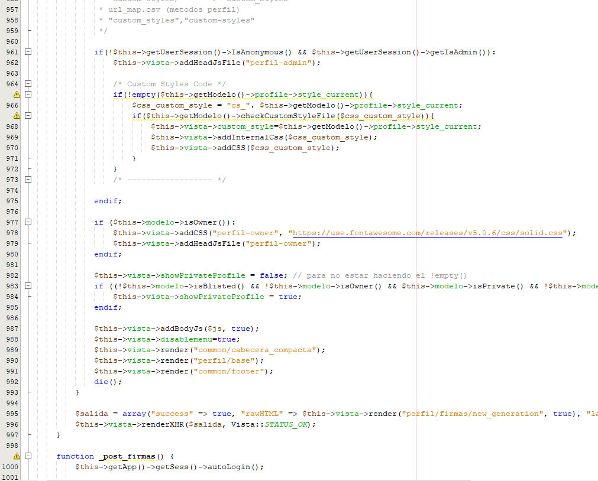

# Developing backend and some frontend in order to upgrade the sites to 2.0

Panaworld required to update their [static websites](/en/projects/upgrading-main-product-line-to-panagen/) to a new 2.0 web with more social and dynamic features. After [I designed the main database](/en/projects/design-and-build-a-big-social-database/) which was the core skeleton for this project, and with the help of our brand new [custom made Ragnet framework](/en/projects/building-new-mvc-based-custom-framework-ragnet/) that I made with another member of the team, it was all set for writting the code that would make the websites real.

In this projects I had to use PHP, MySQL and all the other libraries that the framework offered in order to make the web 2.0 happen (dynamic, social engagement, interactivity). Basically I had to write code for database interaction, make the login and register happen, email confirmation, user profiles, comments, activity feed, friendship system and more features that [you can view with detail here](/en/projects/design-and-build-a-big-social-database/) in the db design process.

Database interaction wasn't the only requirement, I also writted business logic code in order to render views, and code the controllers for each request in order to manage inputs, sessions, models, etc, following the _Model view controller_ (MVC) architecture.

*Some MVC classes*

*Demo code controllers*

*Demo code database interaction*

Furthermore, I had to make upgrades to the frontend, adding new interfaces and features. New interfaces that used AJAX technology, so javascript and jquery was required, and having a rest api for the ajax request was also something I had to do.

This project took me a while since I was the only developer assigned and the list of features was long. I also had to be careful with the SEO because it was the core of the business, this meant that I had to work on critical stuff like 301 redirects, route/url changes, and being very careful with the performance, caching SQL queries or whenever we need. I learned a lot with this project.

List of websites using this project:

There is no guarantee that the websites continue to be online the moment you visit the links

* [macrojuegos.com](http://www.macrojuegos.com)
* [minigamers.com](http://www.minigamers.com)
* [microgiochi.com](http://www.microgiochi.com)
* [microspiele.com](http://www.microspiele.com)
* [microjeux.com](http://www.microjeux.com)
* [microjogos.com](http://www.microjogos.com)
* [macrogames.ru](http://www.macrogames.ru)
* [microgry.com](http://www.microgry.com)