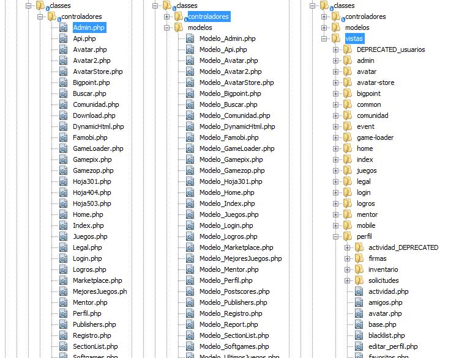
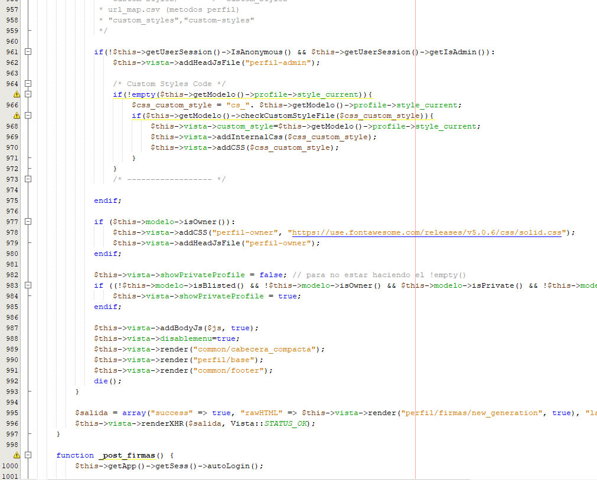

# Desarrollando el backend y frontend para convertir sitios web 1.0 en 2.0

La empresa Panaworld quería actualizar [sus sitios web estáticos](/proyectos/adaptando-producto-principal-a-panagen/) a sitios 2.0 con muchas características sociales y dinámicas. Tras [haber diseñado la base de datos](/proyectos/disenar-y-crear-una-gran-base-de-datos-social/) que haría de esqueleto para la implementación del código, y con la ayuda [del nuevo Framework "Ragnet"](/proyectos/desarrollo-de-ragnet-un-nuevo-mvc-framework/) que creamos entre yo y un compañero de trabajo, llego la hora de finalizar la tarea escribiendo el código para hacer realidad todas las nuevas características.

En este proyecto tuve que utilizar PHP, MySQL y el resto de librerías de nuestro framework para crear las funcionalidades sociales y dar vida a una web 2.0 (dinamismo, engage social, interactiva). Fundamentalmente tuve que escribir código para interactuar con la base de datos y hacer posible login de usuarios, registro, confirmación por correo, perfil de usuario, comentarios en perfiles y en otras páginas de la web, sistema de notificación de actividad, sistema de amistad, y muchas otras más que podeis ver [donde hablo sobre el diseño de la base de datos](/proyectos/disenar-y-crear-una-gran-base-de-datos-social/).

Además de la lógica para el almacenamiento de datos, había que escribir la lógica necesaria para renderizar las vistas, así como el código de controladores para gestionar cualquier tipo de input de url, sesiones o funcionalidades del modelo, siguiendo el patrón _Model view controller_ (MVC).

*Captura de algunas clases MVC*

*Ejemplo demo código controladores*

*Ejemplo demo código interactuando con base de datos*

Además del código backend, aunque el diseño no lo cambiamos demasiado, tuve que hacer muchos arreglos al diseño para añadir nuevas interfaces y características. Así como implementar el Javascript necesario para realizar peticiones AJAX, donde también tuve que programar el backend para gestionarlas y devolver los JSON apropiados.

El proyecto llevó su tiempo ya que era el único desarrollador implicado y la lista de características a desarrollar era bastante larga. Además, había que tener especial cuidado con el SEO que fundamentalmente era la base del negocio de la empresa. Esto implicaba también generar redirecciones 301 donde hubieran cambiado rutas de url, y tener especial cuidado con el rendimiento de la página, cacheando consultas SQL o lo que hiciera falta. Uno de los proyectos donde más aprendí.

Listado de sitios web que utilizan este projecto para funcionar:

No hay garantía de que estos sitios aún sigan online en el momento que se visiten

* [macrojuegos.com](http://www.macrojuegos.com)
* [minigamers.com](http://www.minigamers.com)
* [microgiochi.com](http://www.microgiochi.com)
* [microspiele.com](http://www.microspiele.com)
* [microjeux.com](http://www.microjeux.com)
* [microjogos.com](http://www.microjogos.com)
* [macrogames.ru](http://www.macrogames.ru)
* [microgry.com](http://www.microgry.com)