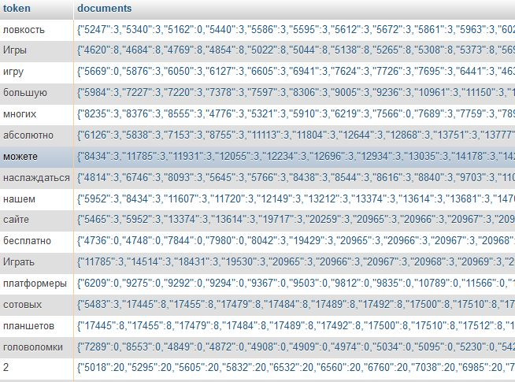

# Developing an internal scalable search solution

Nowdays I'm sure that a lot of third party search solutions exist but back in the day there wasn't too many (at least for PHP). I remember sphinx or sphider but the team didn't like them. In the end what I did was developing it all myself, so we had control on the performance and features.

Let me explain how I made this search engine. The project consists of three parts:

* Data manipulation, tokenization, languages
* Word indexing, documents score
* Retrival algorithm's and query system

## Data manipulation

The first steop when you want to index text is data manipulation. First you have to take into account if you need to separate your index for each language (recommended) in order to apply different stopwords and reduce the index length. After that you have to develop the tokenization, depending on the language you will require to filter different characters or symbols. In my case I had english, spanish, russian, polish, french, italian, german and portuguese so I had to consider each one of them.

Some people, often lazy people or people with a thin deadline, just use MySQL solutions like Fulltext indexing (which requires MYSAM tables). This may work as a search solution but you will have less control over it, no relevancy, semantic, stopword filtering, etc. Other people don't even use fulltext indexing and just execute direct queries to their INNODB tables every time an user search. This may work but good luck with your server performance.

## Indexing words or tokens and documents

This is the step where we will create the index (usually in memory). We gather all the document id's that have some token. For example, for the token `php` it was found in the documents id 4, 10 and 20 so we need to create a varchar column with the string `php`, and on the second column we will index the id's 4,10,20. We can do this step daily or even weekly, depending on the buffer of our content. Choose a moment of the day with less load on your server. You also have the choice to rebuild the index every time your content managers edit or add content, but this is costly, your choice!

If you want to have relevancy in your results, you need to save the proper information in the index. For example position of each word in the document, so you can write an algorithm later on. You can also save score information depending on the things you want, like where is this word appearing, title? heading? end of the document? These things is what the big search engines like Google do (even more complicated things). You don't need to overcomplicate it but remember that if you add some score information to your index, you can sort your results by relevancy or quality after, so you will not deliver results ordered only by date, alphabet or random.

*Example of an inverted-index russian with documents data stored as json*

## Query system or search queries

Finally, once you have the index in your database, you only need to develop the algorithm that will retrive the documents, and of course print all this info as html.

First, the query system. It may be simple, like only letters separated by spaces are considered a token, or more complicated like adding or removing words, for example: `+php +develop -mysql`.

No matter what you choose, in php you will have to develop the logic yourself in order to add or remove documents. For each token, you will get a list of documents from your database and the optional data with them, like score.

If you want relevancy and you stored the word position, you will have to check if the document position come in consecutive. For example for the query `how to update nginx` and when you already had a document with these exact terms somewhere in the text, this document should be returned when asking for the token `how`, with the position 10. The token `to`, should return that same document with the position 11, `update` as 12, `nginx` as 13. This way you can easily write your algorithm that checks for consecutive matching and then order your results by the most relevant on top.

## Conclusion

Once you understand the basic parts of a search engine, is not too hard to develop one. Of course is not the same a search engine that returns webpages, like Google, which requires to crawl the whole Internet and index html... in comparison with your internal data, which is only your content already stored in a database. Sometimes is easier and faster to implement a cusom search engine yourself instead of using third party solutions, which sometimes ain't even open source or free.

The results algorithm is something that you can make it simple or more complex, depending on your requirements. More complexity will lead to more resources in your server. You also have the choice of caching the final resulsts for the most asked keywords in memory for performance.

I like to index enough data in order to return proper ordered quality and relevant content. You can measure the quality of your own content by the amount of content, the order of the tokens, user data like votes, data like the content that haves the most traffic in your website... your imagination defines the limits.