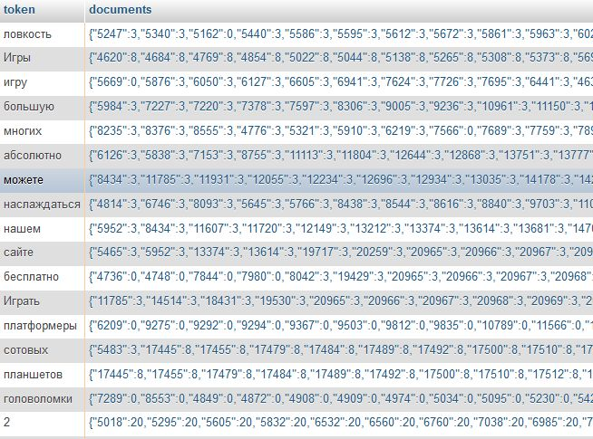

# Desarrollo de un buscador interno escalable

Hoy día puede que existan diversas soluciones y herramientas para implementar un sistema de búsquedas internas en tu web, pero en aquella época no habían demasiadas (al menos para PHP). Más allá de sphinx o sphider que no nos hacían mucha gracia a los desarrolladores de la empresa. Al final lo que hice es desarrollarlo yo mismo, ya que así tendríamos más control sobre el rendimiento y las funcionalidades.

Voy a explicar un poco en que consiste crear un search engine propio. Para desarrollar este proyecto lo dividí en varias partes:

* Tratamiento de datos, tokenización, idiomas
* Indexación de palabras y puntuación de documentos
* Algoritmo de recuperación y sistema de consulta

## Tratamiento de los datos

El primer paso cuando quieres indexar texto es el tratamiento de tus datos. Primero debes tener en cuenta si vas a tener un índice diferente por idioma (recomendable) para aplicar los stopwords necesarios y así reducir en medida de lo posible el tamaño de tu índice. Una vez hecho esto debes desarrollar la tokenización, según el idioma tendrás que prescindir o convertir algunos carácteres en otros, eliminar símbolos de puntuación, etc. En mi caso tenía como idiomas inglés, español, ruso, polaco, francés, italiano, alemán y portugués por lo que hubo que tener en cuenta como funciona cada uno de ellos a la hora de filtrar símbolos y no indexar según que palabras.

Hay personas que directamente no se complican y utilizan las herramientas que proporciona el mismo motor de base de datos, como el Fulltext index de MySQL (que requiere tablas MYSAM). Esto podría servir pero carecerás de mucho control a la hora de recuperar el algoritmo, establecer rankings de relevancia semánticos, stopwords, etc. Otras personas ni siquiera hacen uso de fulltext index (que solo funciona bajo tablas MYSAM) y lo que hacen son consultas directas a sus tablas INNODB, esto también puede servir pero pondrá en jaque el rendimiento de tu servidor.

## Indexación de palabras o tokens y documentos

En este paso lo que se hace es crear un índice, generalmente en memoria, de todos los documentos que contienen cada token o palabra. Por ejemplo si la palabra `php` aparece en los documentos de id 4,10 y 20 se creará un campo varchar con el string `php` que devolverá los id 4,10,20. Normalmente el paso de indexación se puede ejecutar cada cierto tiempo, como a una hora determinada del día donde el servidor no tenga carga. También se puede hacer que se rehaga el índice cada vez que se añade o edita un documento en tu panel de gestión o cms, aquí cada uno elige su solución.

Si deseas tener relevancia de búsqueda puedes guardar la posición de cada palabra en el documento para posteriormente utilizar un algoritmo que priorize las palabras que existen de manera consecutiva. También puedes almacenar en el índice una especie de sistema de puntuación, dependiendo de en que parte del documento aparezca esta palabra, por ejemplo en títulos o al inicio del documento mayor importancia, etc. Esto es lo que hacen desde hace tiempo buscadores como Google en su proceso de indexación. Tú no hace falta que lo hagas tan espectacular como ellos, pero si agregas un sistema de puntuación luego tendrá una mejor relevancia de resultados. De esta forma no tendrás solo la opción de devolverlos en orden de fecha, alfabético, o aleatorio.

*Ejemplo de un índice invertido ruso con documentos guardados como json*

## Sistema de query o consultas de búsqueda

Finalmente una vez tienes el índice de tokens en tu base de datos, solo queda programar el algoritmo que recuperará los documentos y obviamente mostrarlo por pantalla.

Lo primero es el sistema de query, puede no contener nada, ser todo sencillamente palabras o tokens que serán determinadas por cada espacio o puedes tener además sistemas de añadir, o quitar palabras, por ejemplo: `+php +desarrollar -mysql`.

Elijas el sistema que elijas en php tendrás que implementar la lógica necesaria para luego añadir o filtrar documentos. Por cada palabra o token, la base de datos te devolverá una linea con toda la información de los documentos y su puntuación correspondiente.

Si quieres relevancia deberás determinar que documentos deben ir primero según el número de posición indexada, o el sistema de puntuación que indexaste. Por ejemplo si alguien buscara `como actualizar nginx` y tu tenías un documento que en alguna parte de su texto contiene estas palabras de manera consecutiva, ese documento aparecería bajo el token `como` y tendría la posición 10, bajo el token `actualizar` aparecería el mismo documento en la posición 11 y bajo el token `nginx` aparecería con la posición 12. Como ves 10,11,12 son números de posición consecutivos y podrías realizar fácilmente un algoritmo que ordenase la matriz de resultados para que le aparezca más arriba al usuario.

## Conclusión

Una vez entiendes las partes más básicas para crear un buscador, no es muy difícil de realizar. Por supuesto no es lo mismo un buscador que indexa todo internet desde páginas web HTML, a un buscador interno que indexa tus contenidos partiendo de texto almacenado en una base de datos. A veces, sobretodo cuando ya sabes, es más fácil implementar esto que utilizar un sistema de búsquedas de terceros que en ocasiones son hasta de pago.

El tema del algoritmo de resultados, pues te puedes imaginar. Lo puedes complicar tanto como desees. Si lo complicas demasiado deberás tener cuidado a la hora de programar el algoritmo de recuperación ya que puede gastar recursos de más (aunque también puedes cachear el resultado en memoria).

A mi personalmente me gusta indexar la información suficiente para devolverle al usuario contenidos de calidad y relevantes. Te puedes basar en el contenido, en el orden de palabras, en la información de votaciones de tus usuarios, en lo popular que es ese contenido basándote en el volumen de búsquedas o tráfico SEO que tiene, etc.