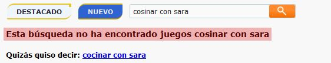

# Creating search suggestion for our custom search

After having finished [the search engine project](/en/projects/developing-custom-search-solution-inverted-index/) the next step was starting logging the user inputs, the keywords. I found that a lot of users wrote keywords that delivered 0 results. These keywords often had spelling mistakes so I decided to create an alternative for the user. Of course when a query returned 0 results I already gave them some content we knew they would like but I decided to give them extra keywords options to follow.

In order to make the system performance friendly, the ideal was generating all these suggestion keywords daily or even weekly using a cron. This way our database would have all the data saved already and the users would have them ready every time they type input without generating them on the fly.

## The problems

Our keyword log dabatase had so much data, so much rows. The algorithm involved for generating search suggestion took too much time so the first step was filtering the data and creating only suggerences for the top 10% keywords. I made a few changes to the logger so we had a counter insights for each keyword. This way the time involved in the generation improved 90%.

With the data already filtered, I used the popular distance algorithm levenshtein. For each keyword that delivered 0 content results, I made sure to generate some keywords suggerences. So the user had something to follow up related to his query. This is not something new, but you rarely see it implemented in custom search websites. This feature improved user interaction in google analytics.

Finally, the last step was saving all the data in the proper way in order have it loading within PHP. This was the final result for keywords like `poquemon` and `cosinar con sara` which are delivered 0 results.

*Search suggestion example from macrojuegos.com*

*Some code about it. Objects and methods involved for this feature*
