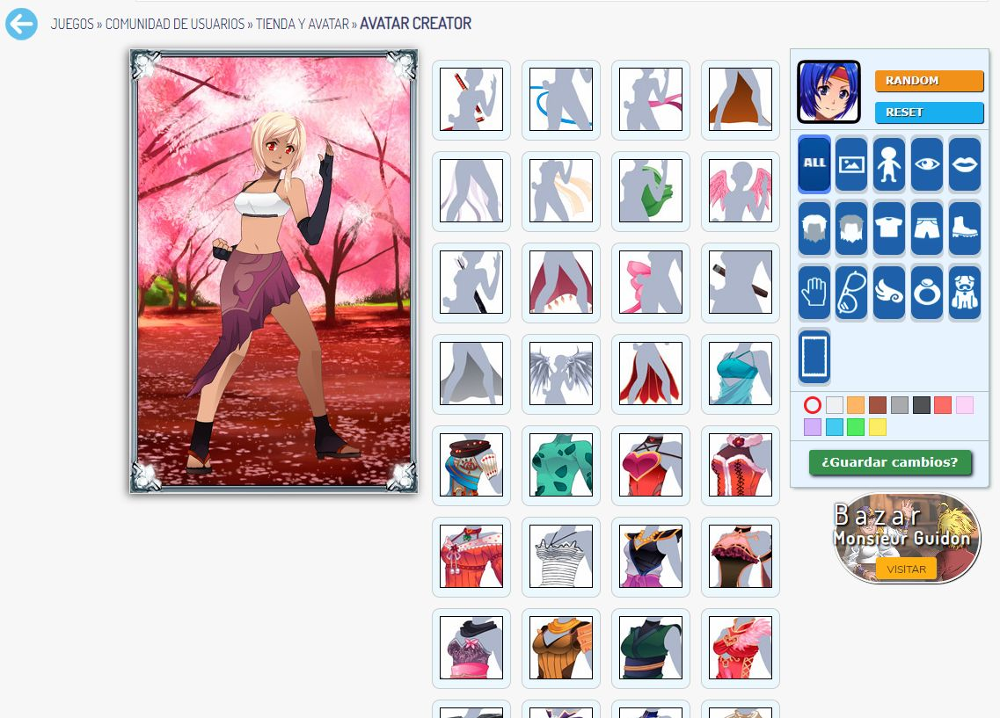

# Making of a backend for an avatar system and a control panel

My company decided to create a system where our users could buy clothes and customize their avatars. They had several models to buy, and each model had several clothes and accesories. The graphic content was made by artist co-workers and uploaded using a control panel that I made for them. The users earned a virtual currency by playing games on the website, this currency could be spended on new avatar models, clothes, accesories, etc.

## Planning the entities for the database

I planned all the required actions by the users and made the proper API endpoints. The project required several tables, some clothes were composed with multiple layers of clothes so it was a little bit complex. Users could buy models, clothes and accesories. Each model, cloth or accesory also required a minimum account level.

## Creating the required tables

After thinking about the entities and preparing the API endpoints all it was left was creating the tables. Models, Layers, Items... Items composed with one or more layers. Items were assigned to Models, etc.

## Programming the API endpoints for the system

With the tables ready I started writting the proper PHP code for each API endpoint. A lot of database code and SQL queries involved here.

## Programming a control Panel for our artists

Our artists required a tool to upload content and tag it with the proper price, miminum level, type of layer, name, model, etc. We were in a hurry so it was a bit ugly but very functional. Using Ajax, jQuery and HTML forms was all it required to work, reaching the API endpoints to save all the data in the proper place.

## Helping a co-worker with a Flash frontend to work with the API endpoints

To make things a little bit faster, a co-worker specialized in Flash created a client for the users. The Flash snippet let them select a model, and configure their avatar. This flash client had to fire requests to my API so I helped him a little bit in the process.

*Users creating Youtube videos about the avatar system*
`youtube:https://www.youtube.com/embed/dPBnj0xgA4M`