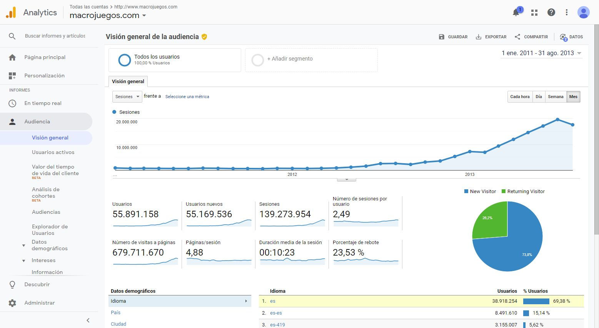

# SEO keyword research and compilation for macrojuegos.com

Because I was in a Startup, Panaworld put me in charge of some SEO business that required programming to make things faster. There were not too many SEO tools back then so I just used a combination of programming scripts Google Keyword Planner.

## What I had to do

Using my technical knowledge I made some programming scripts for Parsing CSV files filled with keywords and their monthly visitors value. We tried hard using Google Keyword Planner, which was a very good way to get SEO insights. Using the app and the keywords recommendation tool we gathered a lot of CSV's. I had to parse all this data in order to treat it after.

With a list of thousands of CSV's, I had to do some cleaning up, merging keywords together and their values. The CVS files contained duplicated keywords, or even languages had issues with non english languages that I had to fix.

Saving keyword data in a database. Just had to make sure all this parsed data was saved to a database with the proper monthly visitors value.

Classify our content by their SEO value. I used the monthly visitors as a "demand score", considering the keywords assigned for each content I did a sum up of all of them. So, we just had a "content SEO value".

Prepare our websites to be able to sort some content categories by their SEO score so the most searched content was seen first. After looking about what the users demanded, I decided making the most demanded content a visible priority, in terms of UX and SEO, this was a very good tactic to improve the SEO of the website.

## Conclusion

After doing all this SEO work and considering that macrojuegos.com has been live since 2006, this and another SEO projects that I made in 2012 and 2013 delivered the following results.

Went from 800,000 to 20,000,000 monthly sessions (+2500%)