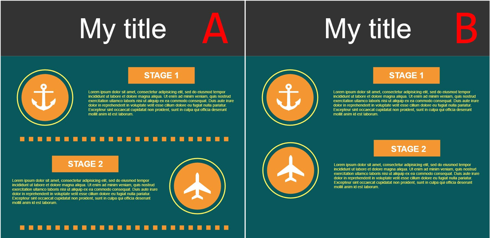
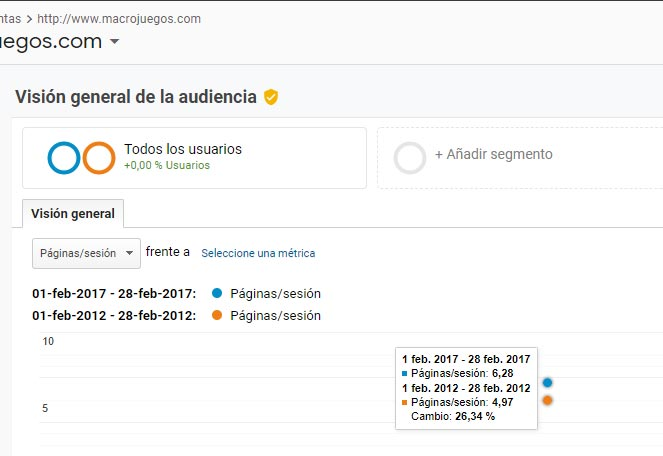

# Creating and testing layout interfaces for UX and SEO

I started this project for Panaworld in parallel with other tasks. We understood good UX means better conversion rates. Better conversion rates means more pageviews, more ads seen, and (yes) better SEO.

Using HTML JS CSS and PHP I made different designs with an UX perspective trying to understand what would make users visit more pages. I tried those test isolated in one page that had enough visitors to measure the differences with Google Analytics. Sometimes changes had to be global, but no risk no reward! This is called A / B testing, especially useful for landing pages. Usually, you do small increments that stay if it improves stats so this project was worth in the long run.

## Conclusion

User engage improved little by little with the time, the more things we tested, the more optimized it was. In the long run you can easilly duplicate your engagement stats like page views per user or less bounce rates.

*Pageviews per user before and after (2012 and 2017)*

