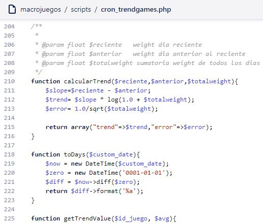
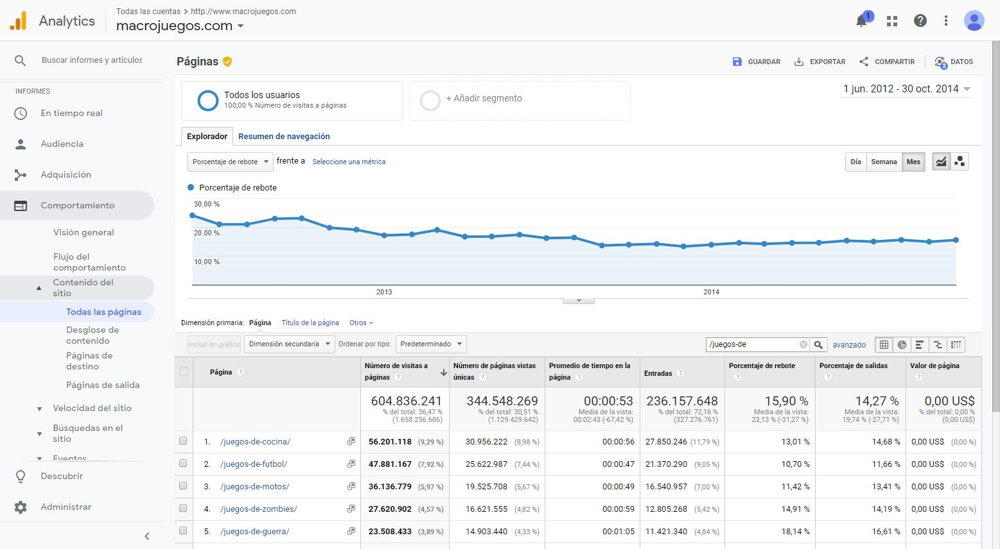
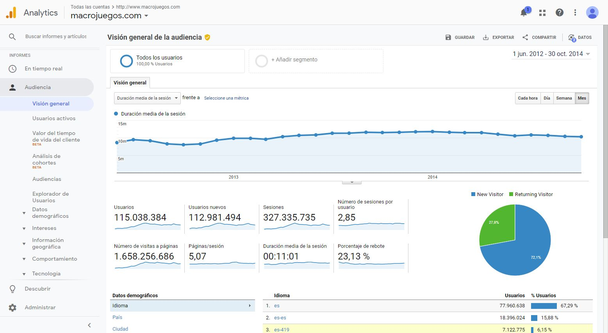
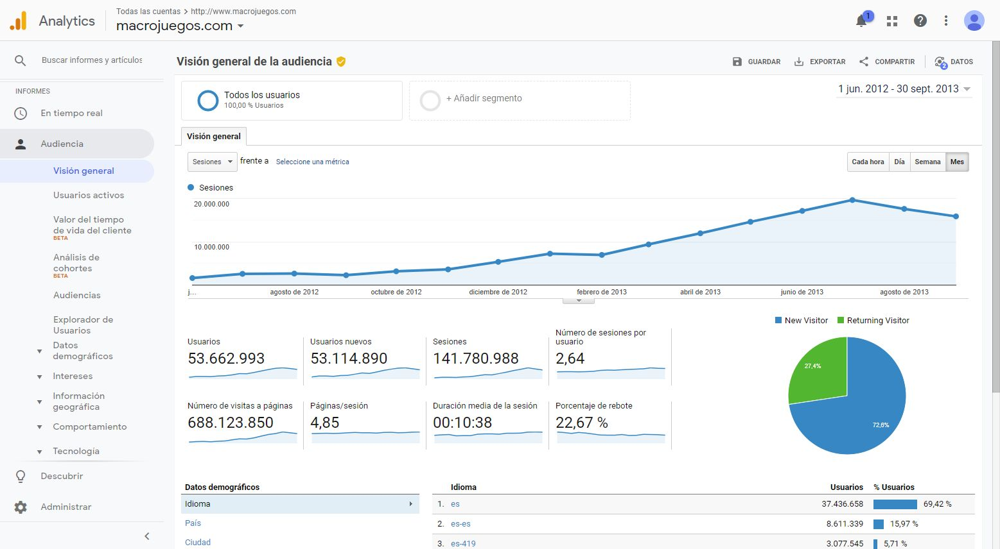

# Ranking your content like Google does with the web

This was one of the best projects I've made that improved our SEO rankings and site statistics by a lot.

When we talk about SEO, we are talking about what the user wants right? at least with white hat SEO. As a developer responsible for the SEO of the companyt business I decided that we should rank our content by quality like Google does with the web.

## But, What is quality?

Well, quality is what the users wants, so... how do we know what the user wants? We know that Google uses more than 200 metrics for ranking websites for each keyword, so I thought it would be a good idea to create an algorithm in a similar fashion.

Our users ranked our content with a score rating so that would be a signal, but not the only one, that would be too easy. The best way to measure if the users wants something is by measuring CTR. For example, we had category pages with a list of thumbnails, listing more content. The user searched for a keyword and went into our site, then clicked at something else. These were the stats I considered for the algorithm.

## Actual algorithm metrics I've used

### Actual Bounce rate of the entire category page

If it was high, the entire collection could be filled with elements that the user was not looking for. So improving this metric means your listings are relevant for the user.

### Category page CTR%

This one is important, it rates what the user wants. Given a list of content thumbnails, the users chose one. Usually, the users had more probability of clicking the top listed content so I took care of this. I had to build a trend sub-algorithm explained below.

### Trends

I also made a trending algorithm using math. We had a lot of content, old and new. Sometimes, old content was better than new and it had less visibility on the website, so this trend algorithm helped "resurrecting" barely visible content because users usually click most visible content right?

### Time the user stays in a content page

I made sure to measure the time each user spent on each content page, in this case, playing a game. More time (excluding loading time) usually means a better game, so better content.

### Loading times

Our content were games and some games required a long loading time, from a UX point of view, games that takes too long to load should be a low priority for the user, unless the other metrics makes this game shine in our algorithm ;)

### User votes and ratings

Just like some other sites do. We gather voting data, so we used it as part of the whole algorithm.

### And more

I used other small metrics that I prefer to keep private.

## Conclusion and proof

After the algorithm was deployed, our collections were sorted by this algorithm score. Soon Google Analytics showed us real user engagement improvements.

Big improvements in Bounce rate. Went down from about 25% to 13% - 15%. (+178%) That is a lot in the SEO industry!

Users stayed longer in our site. Went up from 9 - 10 minutes to about 12 (+129%)

And of course SEO went up and we had new visitors! (+2500%) Crazy isn't it?

