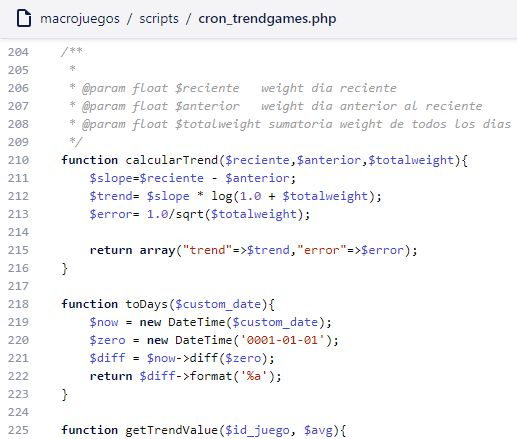
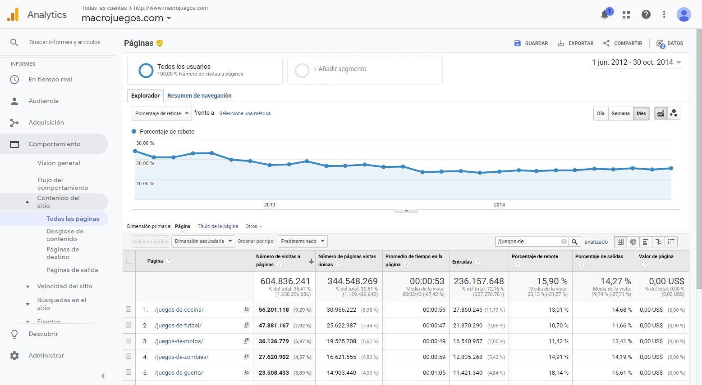

# Ordenando tu contenido igual que Google ordena las webs

Este fue uno de los mejores proyectos que he hecho, mejoró el SEO y las estadísticas del sitio un montón.

Cuando hablamos de SEO, realmente hablamos de lo que quiere el usuario ¿verdad? al menos desde un punto de vista White Hat. Como programador responsable del SEO en la empresa decidí que deberíamos clasificar el contenido por calidad tal y como lo hace Google con las webs.

## Pero... ¿Qué es calidad?

Bueno, calidad es lo que el usuario quiere, ¿y como sabemos lo que quiere el usuario? Sabemos que Google utiliza más de 200 métricas para clasificar los sitios web por cada palabra clave, asi que pensé que sería buena idea crear un algoritmo de forma parecida.

Nuestros usuarios valoraban nuestro contenido con una puntuación así que eso podría ser una señal, pero por supuesto no sería la única, eso sería muy fácil. La mejor manera de medir si el usuario quiere algo es medir el CTR. Por ejemplo, teníamos páginas de categoría con una lista de imágenes de miniaturas, listando así el contenido. El usuario buscaba una palabra clave en google, llegaba a nuestro sitio y entonces hacía clic a algo. Esas estadísticas las consideré en este algoritmo.

## Métricas que utilicé

### Bounce rate o tasa de rebote de las categorías

Si el valor era alto, significa que la colección estaba llena de elementos que el usuario no quería realmente. Así pues, mejorando esta métrica significa que tus listados son más relevantes para el usuario.

### CTR% de la categoría

Esta es importante, mide lo que el usuario quiere. Dada una lista de miniaturas, el usuario escogía una. Normalmente los usuarios tendrán más probabilidad de hacer clic en las miniaturas de arriba del todo así que tuve esto en cuenta. Tuve que crear un algoritmo de tendencias para contrarestar esto, lo explico abajo.

### Tendencia

También hice un algoritmo de tendencia usando nuestras queridas matemáticas. Teníamos mucho contenido, viejo y nuevo. A veces, el contenido viejo es mejor que el nuevo y normalmente tiene peor vibilidad por la web, así que este algoritmo de tendencia me ayudó a "resucitar" el contenido apenas visible que teníamos por que los usuarios casi siempre clican lo más visible ¿No?

### Tiempo que el usuario pasa en el contenido

Me aseguré de medir el tiempo que el usuario pasa en cada contenido, en este caso, jugando a juegos. Más tiempo (excluyendo el tiempo de carga) normalmente significaba un mejor juego, o sea mejor contenido.

### Tiempos de carga

Nuestro contenido eran juegos y algunos tardaban mucho en cargar, desde una perspectiva de UX, los juegos que más tardan en cargar deberían ser una prioridad baja para los usuarios, a no ser que otras métricas hicieran a este juego brillar en nuestro algoritmo ;)

### Votos de usuarios y ratings

Como otros sitios web hacen, almacenamos datos de votaciones, por lo tanto esto fue utilizado a favor en nuestro algoritmo.

### Y más

Usé más metricas que prefiero dejar privado.

## Pruebas y conclusiones

Después de desplegar el algoritmo, nuestras páginas de categoría ordenaron sus contenidos con este algoritmo. Pronto, Google analytics nos empezó a mostrar mejoras estadísticas del engage.

Grandes mejoras en el Bounce o tasa de rebote. Disminuyó de 25% a 13% - 15%. (+178%) ¡Eso es un montón en la industria SEO!

Los usuarios pasaban más tiempo en nuestro sitio. Subió de 9 - 10 minutos a aproximadamente 12 (+129%)

Y por supuesto el SEO subió y tuvimos un montón de visitas (+2500%) ¿Mola eh?

