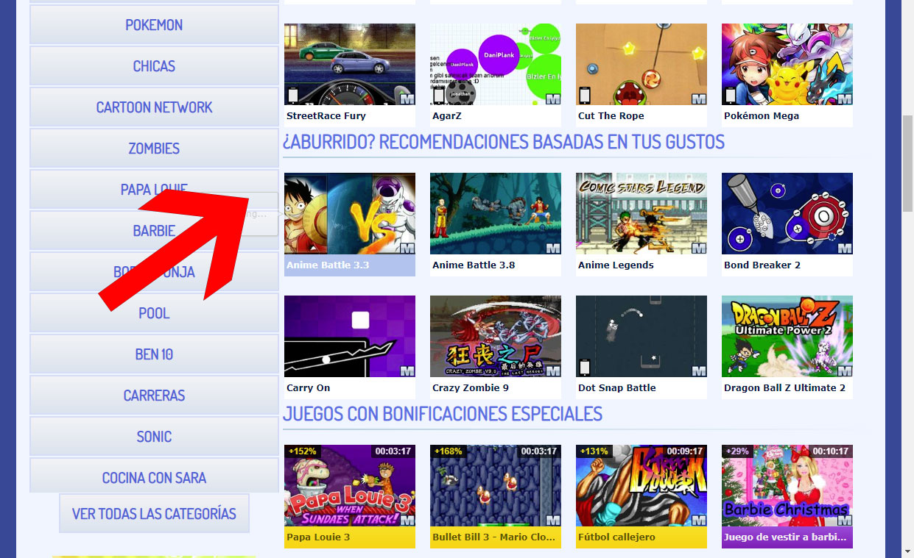
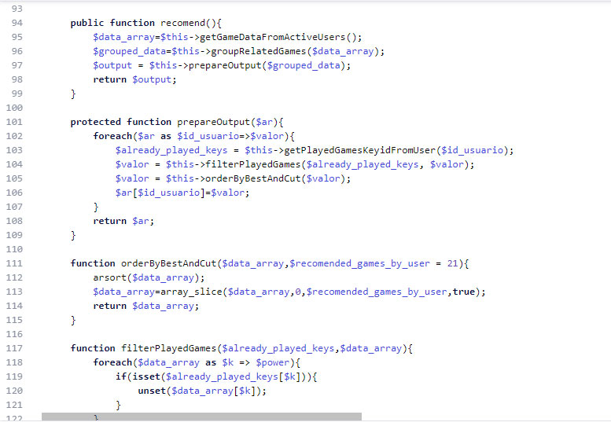

# Creating a content recommendation system for macrojuegos

As the product owner of macrojuegos.com I decided to build this feature. This one was developed by myself.

When you have a website with users that login and you start to save their actions and visits through your site, you will have the power to create personalized recommendations for them. These days big websites like Youtube already do this, and they even use artificial inteligence. I didn't used AI but instead made an algorithm.

## The algorithm (without AI)

For the algorithm I just checked with a few SQL queries what were the games that the user played the most. After that, I asked to our database to give me the recommended games for each of these games, we just happen to have another algorithm that recommends games related to one game, not considering what the user has played. So I merged all the games and filtered out the ones that were already played by the user and voilá. A fancy and cheap recommendation system, no AI required.

*Example of a few lines of code involved in the project*

## Preparing data denormalized in our Databases

Because the algorithm was expensive I decided to perform the 'calculations' daily, and only for the users that logged in at least in the last 3 months. So it was fast.

The only thing missing was to save that list of games to the database. So a few extra SQL queries with PHP did the trick.

## Conclusion

Sometimes your users get stuck and don't know what to do in your website, giving them hints and recommending them content that is aligned with their tastes is a very good feature every big website should have.
