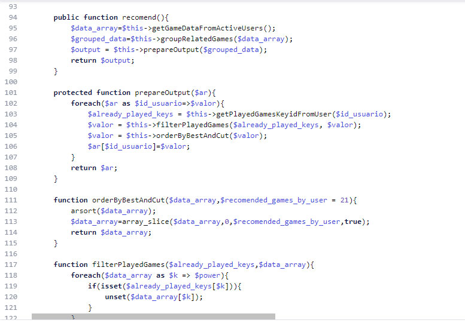

# Creando un sistema de recomendación de contenidos para macrojuegos

Como recién ascendido a 'Product Owner', manager de producto o como lo llamen hoy decidí que sería buena idea crear esta característica en la web. Ésta en concreto la desarrollé yo mismo.

Cuando tienes un sitio web con muchos usuarios que tienen ya cuenta y se logean, empiezas a grabar algunas de sus acciones por el sitio, de esta manera tendrás el poder de crear cosas como el contenido personalizado. Hoy día las webs grandes como Youtube tienen ya esto, además utilizan inteligencia artificial en el proceso. Yo no usé IA pero hice un algoritmo bastante funcional.

## El algoritmo (sin IA)

Para el algoritmo simplemente comprobé con algunas consultas SQL cuales eran los juegos con los que cada usuario se divertió más. Después, me dispuse a extraer de la base de datos los juegos recomendados para cada uno de estos juegos, resulta que ya teníamos otro algoritmo que creaba recomendaciones basadas en como era cada juego, sin considerar los juegos que ese usuario había jugado. Así pues, junté las listas de juegos y filtré los que ya habían sido jugados por el usuario y voilà. Un sistema de recomendaciones barato, eficiente y sin inteligencia artificial.

*Un ejemplo de código relacionado con el proyecto*

## Preparando los datos, denormalizando y grabando en la base de datos

Como el algoritmo era costoso decidí ejecutarlo diariamente mediante cron y solo para usuarios que se logearon en los últimos meses. Por tanto, era rápido de ejecutar.

Lo único que quedaba era grabar esa lista de juegos en la database. Así pues, escribir unas consultas de SQL extra en PHP remataron el trabajo.

## Conclusión

A veces tus usuarios se atascan y no saben que hacer en tu web, darle spistas y recomendaciones de contenido que se alinea con sus gustos es una buena característica que todo sitio más o menos grande debería tener.
