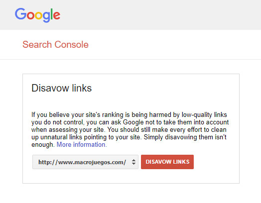

# Limpiando los enlaces de un ataque SEO

Tras haber tenido éxito con el SEO, gracias a los cambios y características que hicimos a los sitios web de la empresa, de pronto Google nos avisó de una penalización manual. La empresa con la que trabajaba dio prioridad a esto. Como era una pyme varios empleados tuvieron que dejar lo suyo y ponerse con esto. Me hice cargo del tema y junto a ellos di las directrices para solucionar el problema.

## El ataque

El ataque era que nos apuntaron a nuestra web con un montón de enlaces desde páginas pequeñas muchas de ellas creadas de forma automática. El primer paso que dimos fue mandar a Google una reconsideración. Nos declaramos inocentes de esta historia. Google respondió con un mensaje diciendo que vale, pero que teníamos que limpiar igualmente enlaces o hacer el máximo esfuerzo posible para ello. Flipante ¿eh?

## La solución

Decidí usar una herramienta llamada majestic SEO. Esta herramienta nos daba información sobre todos los enlaces entrantes que tenía el sitio web. Además tenía un sistema de puntuación donde podías más o menos averiguar que enlaces provenían de webs de baja calidad. Tras filtrar todos los enlaces naturales que macrojuegos.com había recibido desde el año 2006, comenzamos a pensar la forma de eliminarlos. Intentamos de contactar mediante formularios, enviar correos al dueño del dominio, pero eso solo funcionó en pocas ocasiones. Unos días más tarde, Google anunció su [Herramienta Disavow](https://support.google.com/webmasters/answer/2648487?hl=es).

Utilizamos esta herramienta para borrar al menos 20 enlaces y hicimos la reconsideración de nuevo. La denegaron sin piedad y no respondieron ningún mensaje. Después de toda una semana borrando enlaces tuvimos que añadir a disavow algunos enlaces que eran naturales pero provenían de sitios web pequeños como blogspot o similares. Eran enlaces naturales, es triste que tuvieramos que borrarlos, cosas de Google.

Finalmente enviamos la reconsideración y la aceptaron.

## Conclusión

En esa época Google se volvió loco baneando a webs. Escuchamos noticias y quejas de varios webmasters, un montón de penalizaciones sin sentido. Tiempo después, se dejaron de oir historias de este tipo, parece que Google calmó un poco las aguas. Como esto pareció eliminar webs de los resultados de Google, muchos black hat SEO intentaron hacer ataques de este tipo hasta que Google tuvo que hacer algo para ignorar este tipo de enlaces por que dejaron de penalizar sitios web. Con Google nunca se sabe, nunca sabremos que hizo.
