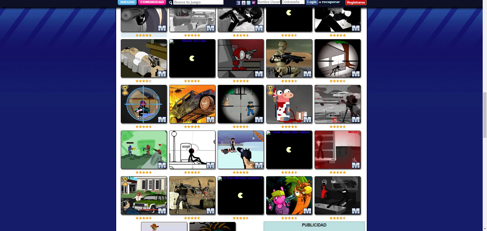
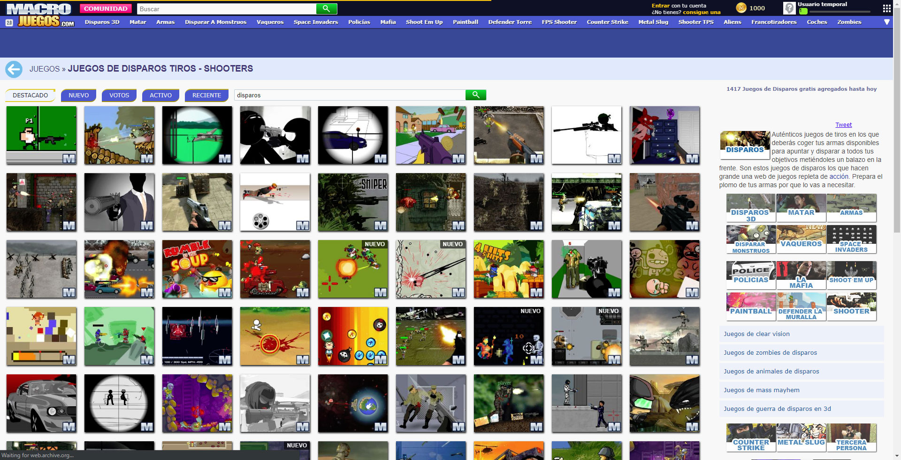

# Scaling layouts to desktop responsive

Around 2012 the World Wide Web Consortium (W3C) approved and recommended the use of media queries. This is known as responsive designs or responsive layouts. Our company websites had a layout optimized for 1024px resolutions. Because the product of those websites (Flash games) were only available for Desktop, we didn't made responsiveness for mobile or tablet resolutions, instead, we scaled from 1024 to 1920 resolutions. I was the person in charge of developing these features.

*Category page before making our layouts responsive*

*Category page after making our layouts responsive*

## Ad placement optimization

With bigger resolutions there was more space on the screen for advertising optimization. Using CSS media queries and javascript, because games were loaded with it, I started to write and make Adsense Ad changes happen. Ad revenue improved by a significant amount.

## What about mobile?

In order to create layouts for mobile we required first HTML5 technology, that didn't happen until 2014 - 2015. Not only that, we needed HTML5 games so it required even more time. The leap from Flash to HTML for the browser games market happened around 2015 - 2016.