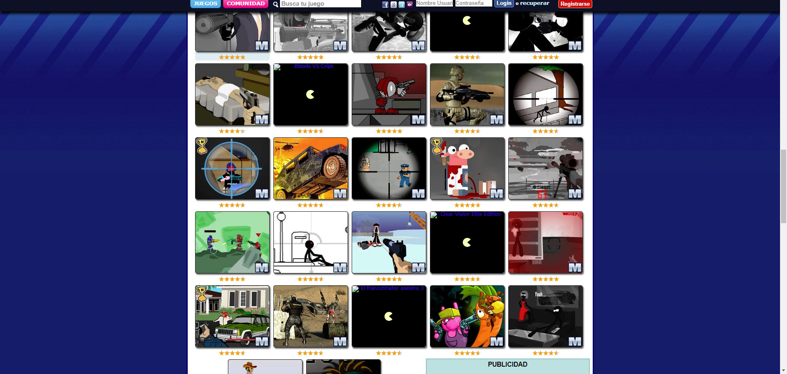

# Escalando los diseños para ser responsive en desktop

Por el año 2012 El 'World Wide Web Consortium' aprobó y recomendó el uso de 'media queries'. Esto se conoce como diseños responsive o maquetaciones responsive. Las webs de mi empresa tenían una maquetación optimizada para pantallas de 1024px de resolución. Como el producto de estas webs eran juegos flash solo podíamos adaptar para Desktop, no creamos resoluciones responsive para móviles ni tablets, en lugar de eso escalamos desde 1024px hasta 1920px y en adelante. Fui la persona encargada del desarrollo de este tema.

*Página de categoría a 1920 antes de hacerse responsive*

*Página de categoría a 1920 después de hacerse responsive*

## Optimización de banners de publicidad

Con mayores resoluciones teníamos más espacio en pantalla para optimizar mejor la publicidad. Utilizando media queries de CSS y javascript, ya que los juegos flash cargaban con él, empecé a escribir código y a hacer los cambios de Adsense pertinentes. Los ingresos por publicidad aumentaron considerablemente.

## ¿Y que pasa con los móviles y tablets?

Para poder crear diseños responsive para móviles y tablets primero necesitabamos la tecnología HTML5, ésta no llegó hasta 2014-2015. Además, necesitabamos que existieran estudios, empresas y desarrolladores independientes que crearan los juegos con HTML5, esto no empezó a ocurrir hasta 2015 - 2016.