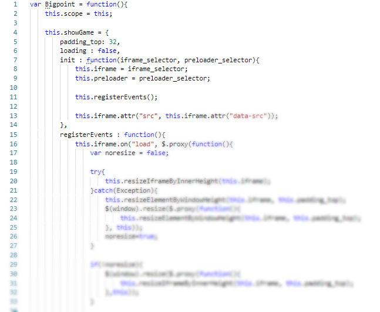
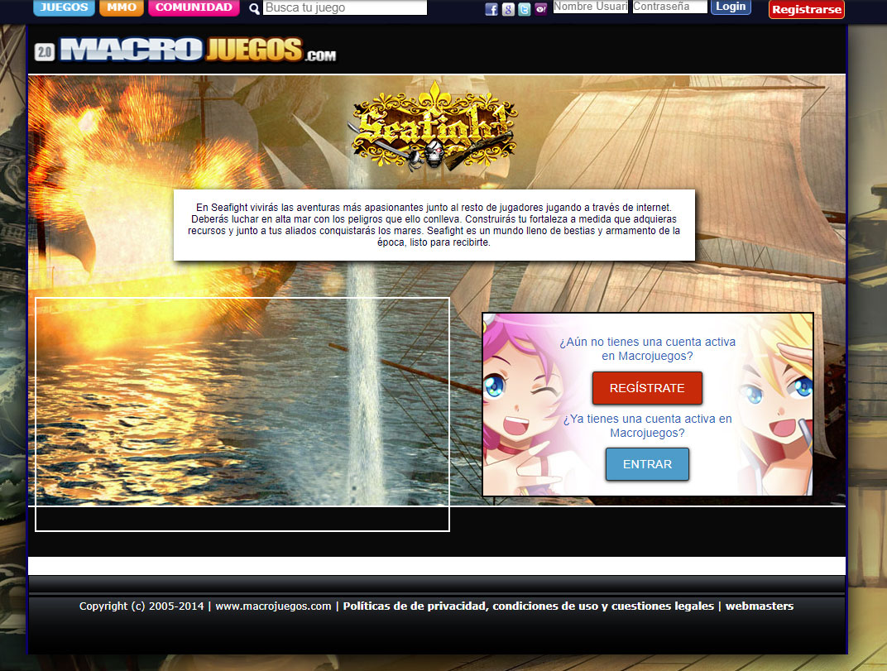

# Integrating an API from Bigpoint

Bigpoint was a big company from Germany. They developed a few products, big massively multiplayer online games. My company asked me to integrate their API to create a special section in our website.

## Dealing with a third party API

Bigpoint sent us their documentation so I could start. I won't lie, their documentation was crap. There were issues that I had to solve doing a lot of tricks and hacks here and there.

The worst part about their API was that it was a PHP api, server side API, not a good idea. After requesting data with it, I noticed that sometimes it took way too long to reply and hung our server. If you are making an API at least make it reply fast. If you don't want to hang every server with PHP as cgi, build your API with javascript. The async aspect of javascript in the browsers is the proper way to handle most APIs. I ended up creating an API that requested their API and this API was fetched using ajax from javascript. The problem of server hung was still an issue but at least our users didn't feel a delay.

*A game from Bigpoint integrated in macrojuegos.com*

*List of Bigpoint games fully integrated*

