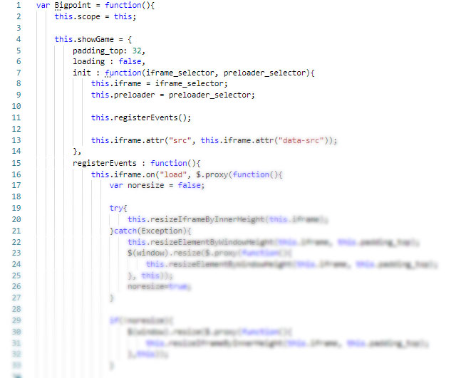
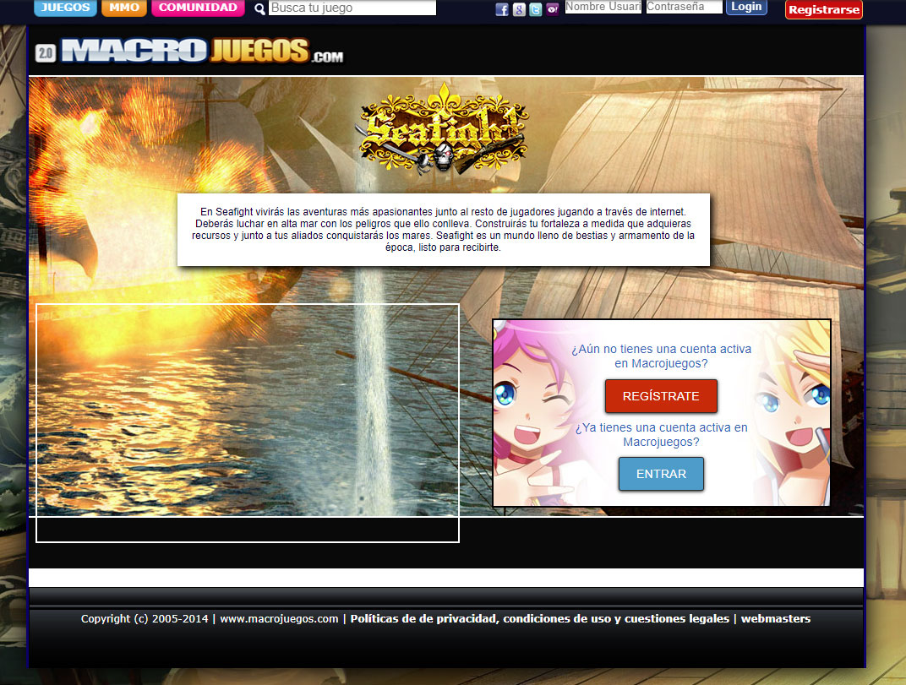
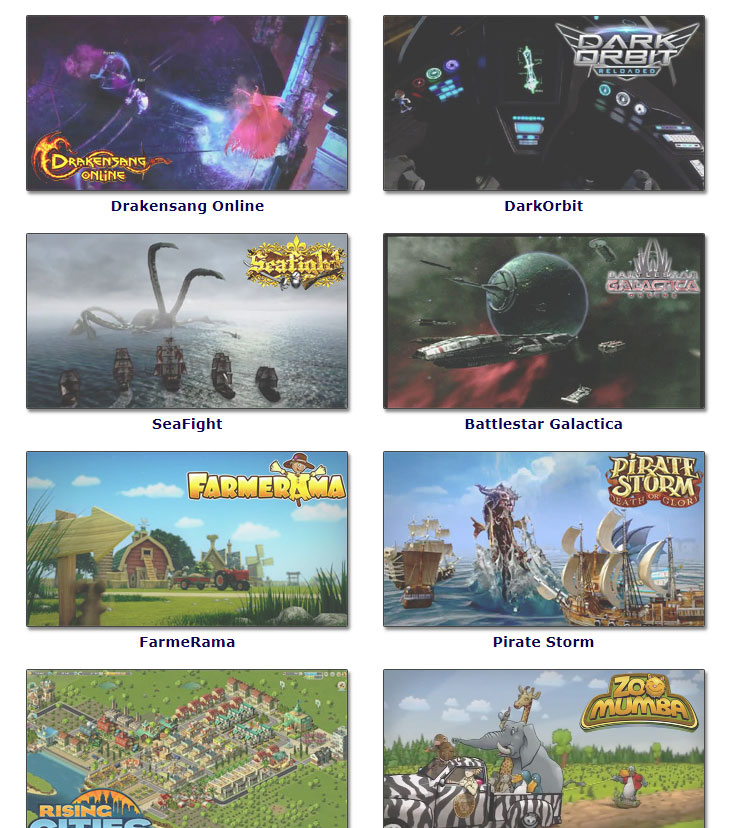

# Integrando el API de Bigpoint

Bigpoint era y es una gran empresa Alemana. Desarrollaron unos cuantos productos, juegos masivos multijugador online con bastantes jugadores. Mi empresa me pidió que integrase su API para crear una sección especial en nuestras webs.

## Tratando con APIs de terceros

Los de Bigpoint nos enviaron su documentación para que pudiera comenzar. No os voy a engañar, su documentación era bastante mala. Habían algunos problemas que tuve que resolver tirando de hacks y ñapas.

La peor parte de la API era que era PHP, o sea API de servidor, no era una buena idea. Después de hacer peticiones con ella, me di cuenta que a veces tardaban un montón en resolverse y colgaba nuestro servidor. Si vas a hacer una API al menos haz que responda rápido. Si no quieres colgar sus servidores PHP, mejor haz el cliente del API con javascript. El aspecto asíncrono de javascript en los navegadores es la manera adecuada de manejar la mayoría de APIs. Terminé creando yo una API que internamente llamaba a sus API y esta era llamada desde javascript vía AJAX. El problema es que aun así las peticiones de PHP del server se colgarían pero al menos el usuario no lo notaría tanto.

*Un juego de Bigpoint integrado en macrojuegos.com*

*Lista de juegos de Bigpoint integrados*

