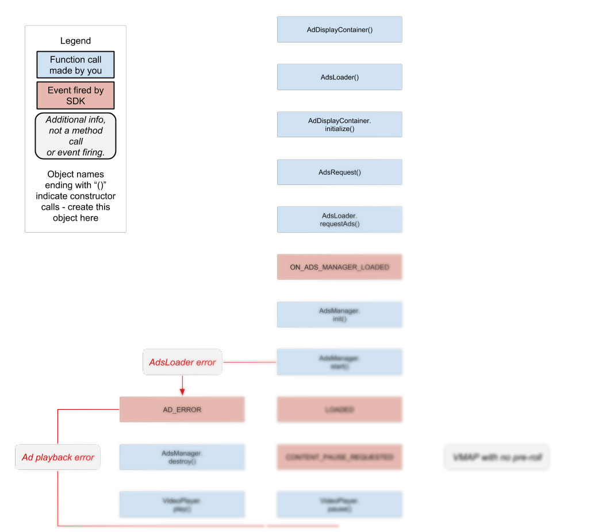

# Integrating IMA3 SDK adsense for video and games

IMA3 SDK Lifecycle, property of Google. Image has modifications. Licensed under [Apache license](https://apache.org/licenses/LICENSE-2.0) and [creative commons](https://creativecommons.org/licenses/by/4.0/).

API implementations is something that every developer will have to do at some point. Google created an API for special ads that played at the start of videos, in between of videos, and could be used in videogames.

I had to implement all the triggers required for showing the ads and following Google guidelines in the process. Things like countdown timer, preloading, skip button, autoplay and other configurations for the type of ads.
