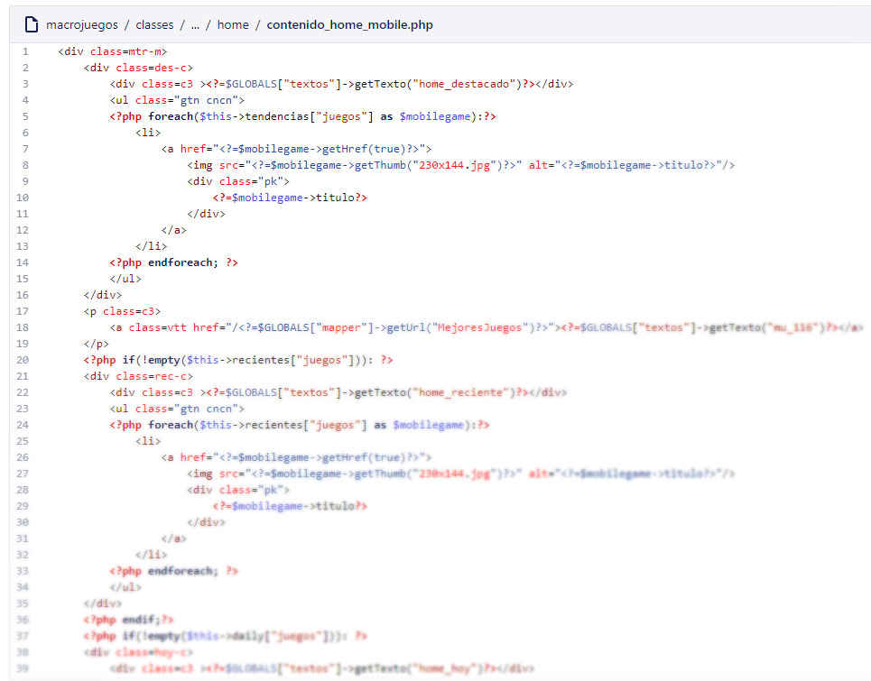

# Adapting macrojuegos.com for mobile using dynamic html serving

Finally, our company had some HTML5 browser game providers so with those games we could serve mobile friendly layouts with playable games on mobile (remember Flash games didn't work on mobile). Usually, the best aproach is to just create your layout design fully responsive using CSS, from mobile to the bigger desktop resolution, but when you need to serve different content your only chance is using that [dynamic html serving](https://developers.google.com/search/mobile-sites/mobile-seo/dynamic-serving?hl=en) technique that is recommended by Google itself.

## Entire different views (html code) for mobile

Dynamic HTML serving means that you serve different HTML from the server. You do this by using regular expressions parsing users 'User Agent' so you can see if they are on a mobile device. Its recommended to use a parsing library like [mobile detect](https://github.com/serbanghita/Mobile-Detect). You have to tell the search engines that your content vary using the [Vary header](https://developer.mozilla.org/en-US/docs/Web/HTTP/Headers/Vary). Then you have to start coding HTML CSS and javascript from start, because it will be like if you start a mobile only website from scratch.

*Several layouts for each page had to be created again*

*New view for mobile homepage example code*

## Conclusion

Sometimes you don't have a choice. You have to serve your site for your mobile users but you work with what you have. In this case, dynamic html serving was the silver bullet. I only recommend doing this technique when you have no other choice which in our case was that Flash games didn't work on mobile devices. As a developer you have to be resourceful and think about every possible solution depending on what you have.
