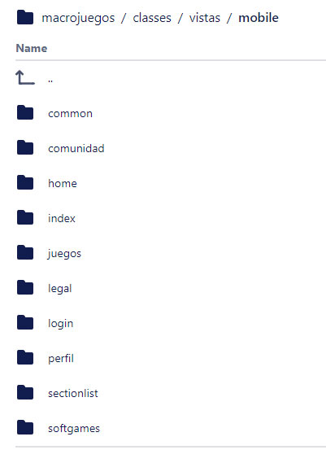
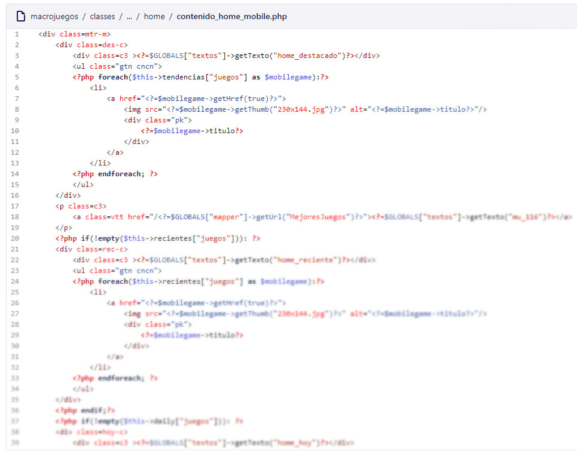

# Adaptando macrojuegos.com para móvil utilizando dynamic html serving

Finalmente nuestra empresa tuvo algunos proveedores de juegos de navegador HTML por lo tanto ya podíamos servir nuestra web a usuarios de móviles que jugarían a estos juegos (los juegos flash no funcionaban en móviles). Normalmente lo normal es crear maquetaciones totalmente responsive utilizando CSS, desde resoluciones para móviles hasta las pantallas más grandes de escritorio. Pero, cuando necesitas servir contenido diferente la única manera es utilizar la técnica de [dynamic html serving](https://developers.google.com/search/mobile-sites/mobile-seo/dynamic-serving?hl=es) que el mismo Google recomienda.

## Vistas diferentes por completo (código html) en móviles

'Dynamic HTML serving' significa que sirves diferente HTML desde el servidor. Haces esto utilizando expresiones regulares para detectar el 'User Agent' del usuario y adivinar si utiliza un dispositivo móvil. Es recomendable utilizar una librería como [mobile detect](https://github.com/serbanghita/Mobile-Detect). Tienes que decirle a los buscadores que tu contenido es variable, para ello utilizas la cabecera [Vary header](https://developer.mozilla.org/es/docs/Web/HTTP/Headers/Vary). Finalmente empiezas a escribir código HTML, CSS y javascript desde cero, ya que parecerá como si estuviera creando una nueva web solo para móviles.

*Se tuvieron que volver a crear diferentes maquetaciones para cada página*

*Nueva vista de la home para móvil código de ejemplo*

## Conclusión

A veces no tienes elección. Tienes que servir tu sitio web a los usuarios de móvil y lo haces como sea con lo que tienes a mano. En este caso, la técnica dynamic html serving fue la solución perfecta. Recomiendo solo utilizar esta técnica cuando no tienes otra opción que en nuestro caso fue que los juegos Flash no funcionaban en dispositivos móviles. Como desarrollador tienes que ser espabilado y pensar la solución que vas a dar dependiendo de lo que tienes.
