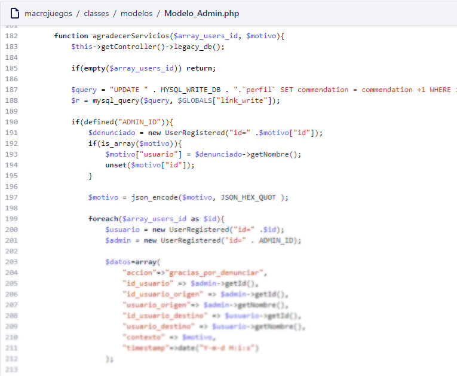
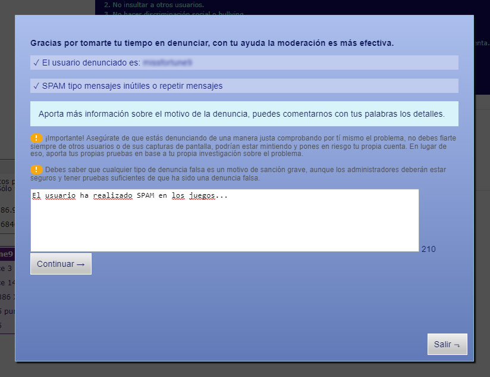

# Creating a complete moderation system for the users of macrojuegos.com

When your user base grows more and more community issues start to happen. User behaviour is not something we can predict so we need to make sure to deliver the proper tools to help with the moderation. I was in charge of creating this kind of system for Panaworld, [macrojuegos.com](http://www.macrojuegos.com) [minigamers.com](http://www.minigamers.com) and the respective countries.

## Reporting users

As an user you will often see other user comments and even suspect other violations of the terms of service. So the basic tool a user need is the reporting tool.

Users could:

* Report from comments
* Report from profile page
* Select a report category
* Write down report reason
* Send proof as image

*Example spanish reporting tool*

## Admin moderation tool

As an admin you must be a judge and so have the proper tools for it.

Admin features:

* Find reported users sorted by number of reports
* Filter users by category
* Filter users by date / time
* Filter reports with proofs
* Reading user report information
* Checking out proof links
* Mark each report for giving moderation credits
* Open a investigation tool
* * Search for a given word and investigate user comments
* * Check for accounts with the same IP address
* Select Admin action
* * Ban user so that account was unable to login
* * Silence his account so that user couldn't write comments
* * Give a warning so that user may behave
* * Absolve, deleting all involved reports

Reports checked down as useful would end up giving some digital money to the user that sent it

*Some of the Admin moderation tools*

## Conclusion

Any website that has a big community of users is going to require moderation tools. Thinking about how you will punish your users, planning the UX of the report system well and giving admin the proper tools are key for building a sane community.
