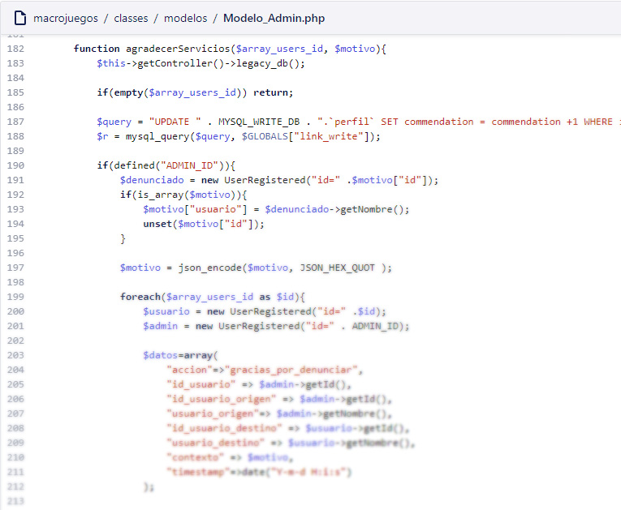
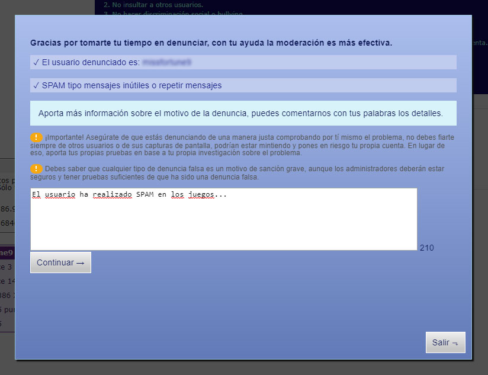
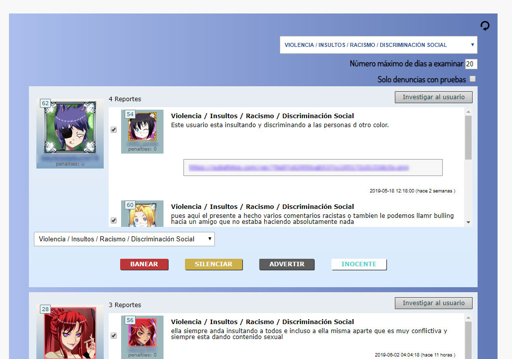

# Creando un completo sistema de moderación para los usuarios de macrojuegos.com

Cuando tu volumen de usuarios crece, empezarán a aparecer más y más problemas sociales. El comportamiento del usuario no es algo que se pueda predecir así que tenemos que asegurarnos de crear las herramientas adecuadas para ayudar con la moderación. Me encargaron crear este sistema para Panaworld, [macrojuegos.com](http://www.macrojuegos.com) [minigamers.com](http://www.minigamers.com) y las otros países.

## Reportar usuarios

Como usuario normalmente vas a encontrarte comentarios de otros usuarios o incluso otros aspectos que violan los términos de uso del servicio. Por lo tanto, la herramienta básica es el poder reportar.

El usuario debía poder...

* Reportar comentarios de otros
* Reportar desde el perfil de otro
* Seleccionar la categoría de reporte
* Escribir tus razones del reporte
* Enviar pruebas en forma de imagen

*Ejemplo de la herramienta de reporte*

## Herramientas de moderación para Admin

Como Admin tu eres el juez así que más vale que tengas las herramientas adecuadas para ello.

Características:

* Encontrar usuarios reportados y listarlos ordenador por número de reportes recibidos
* Filtrar usuarios por categoría
* Filtrar usuarios por fecha o tiempo
* Filtrar reportes por pruebas
* Leer la información de reportes de usuario
* Comprobar las pruebas enviadas
* Marcar cada reporte para enviar agradecimientos en forma de créditos virtuales
* Abrir herramientas de investigación avanzada
* * Buscar ciertas palabras clave entre los comentarios de un usuario
* * Comprobar por IP si utiliza otras cuentas
* Determinar la acción de administrador
* * Banear el usuario de modo que no podrá logear más
* * Silenciar su cuenta temporalmente de modo que no podrá escribir comentarios
* * Enviar una advertencia al usuario para ver si deja de faltar a los términos de uso
* * Absolver y borrar todos los reportes que tenía ese usuario

Los reportes marcados como útiles enviarían dinero digital al usuario que hizo ese reporte, para fomentar su uso

*Algunas herramientas de moderación de administrador*

## Conclusión

Cualquier web que tenga una gran comunidad de usuario va a necesitar herramientas de moderación. Pensar como vas a penalizar a tus usuarios, planear la experiencia del usuario utilizando las herramientas de reporte y dando a los administradores las herramientas de poder necesarias son la clave para crear comunidades sanas.
