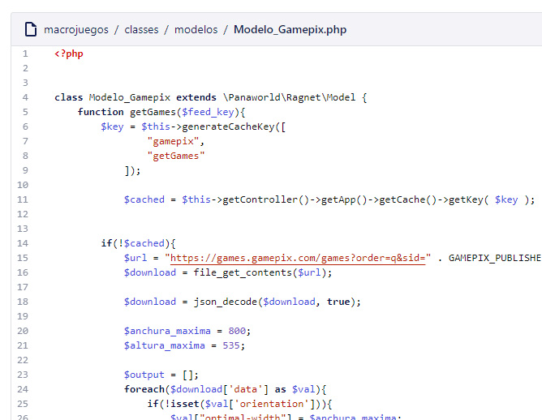
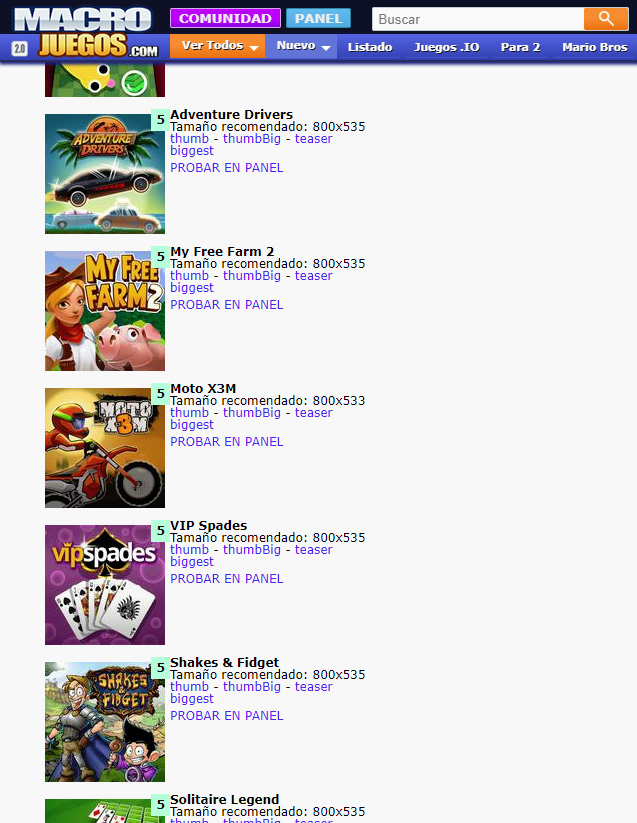
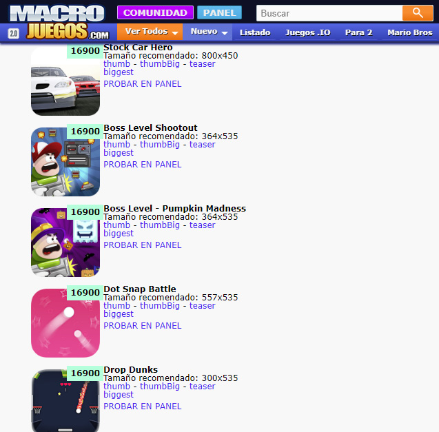
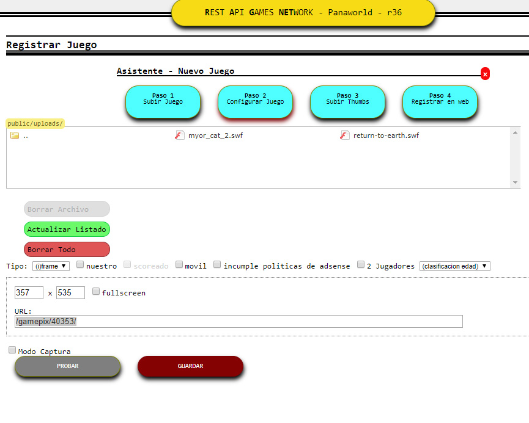

# Implementing different APIs for each company that delivered us HTML5 games

Html5 technology was on fire. A lot of startups tried to build their empires by creating a lot of html5 games and being their own publishers. My company asked me to implement each of their API's into a common control panel to manage content easier. Each API was different, some used PHP, some used Javascript, some just gave us an Iframe url.

List or providers:

* [GamePix](https://www.gamepix.com/)
* [GameZop](https://www.gamezop.com/)
* [SoftGames](https://www.softgames.de/)
* [Famobi](https://games.famobi.com/)

## Pulling data from their API

Implementing a model for each API was the first step. Pull the data, prepare it into a common data structure or doing whatever I was required to do to make it work.

## Creating internal pages that played the games

In order to make the games work from internal urls I had to implement special game controller, model and view to make these games playable there. For example this is a GamePix game url where you can play the game.

[http://www.macrojuegos.com/gamepix/40353/](http://www.macrojuegos.com/gamepix/40353/)

## Creating a common view Panel for the content managers

Our content managers had their own panel to add content to the websites. I made this publisher games view allowed only by Content Managers and Admins where they could grab the final game url and just press a button to have the game ready in the other control panel they used.

*Famobi publisher games, example view*

*Games from gamepix, same view*

This was an old control panel for registering games where I sent our content managers with a simple click, so they could register these mobile games.

*Old legacy control panel in the process of a gamepix game addition*

