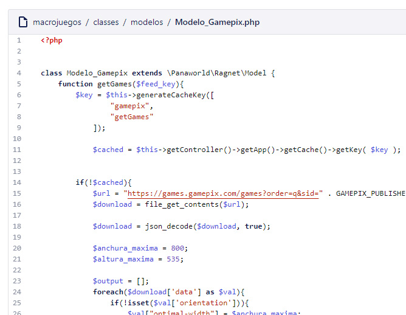
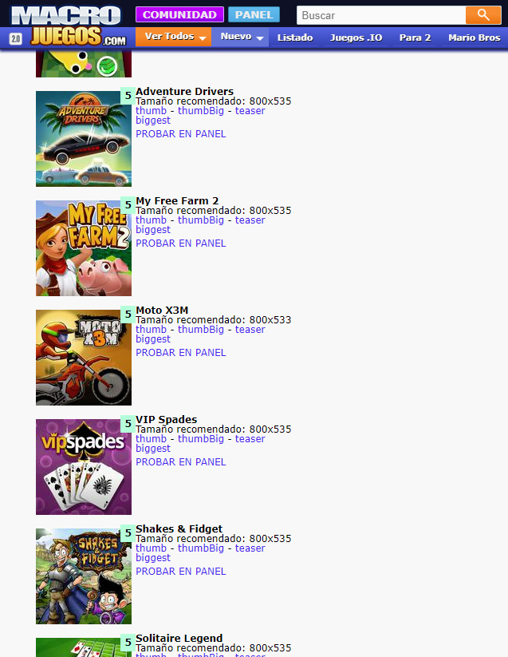

# Implementando APIs diferentes para cada compañía que nos servía juegos HTML5

La tecnología HTML5 estaba en auge. Muchas pymes o 'startup' intentaron crear su propio imperio creando un montón de juegos html5 para convertirse en proveedores. Mi empresa me pidió implementar cada una de sus APIs en un panel de control común para manejar el contenido más fácilmente. Cada API era diferente, algunas usaban PHP, otras Javascript, otras simplemente nos daban un Iframe.

Lista de proveedores integrados:

* [GamePix](https://www.gamepix.com/)
* [GameZop](https://www.gamezop.com/)
* [SoftGames](https://www.softgames.de/)
* [Famobi](https://games.famobi.com/)

## Pidiendo datos a sus API

Implementar un modelo para tratar con cada API era el primer paso. Pedir los datos, prepararlos en una estructura de datos común o haciendo lo que hiciera falta para hacerlos funcionar.

## Creando páginas internas para tener esos juegos jugables

Para tener los juegos de cada compañía jugables en URL's internas tuve que implementar controladores modelos y vistas especiales para tener esos juegos accesibles ahí. Por ejemplo, esta es una URL de un juego de GamePix.

[http://www.macrojuegos.com/gamepix/40353/](http://www.macrojuegos.com/gamepix/40353/)

## Creando un panel de control común para los content managers

Nuestros content managers tenían su propio panel para añadir contenidos a los sitios web de la empresa. Hice esta vista para que ellos pudieran ver los juegos de estos proveedores y pudieran acceder a sus paneles de control para registrar el juego haciendo clic en un solo un botón.

*Juegos del proveedor Famobi, lista de ejemplo*

*Juegos del proveedor GamePix, lista de ejemplo*

Este era un panel de control antiguo para registrar juegos. Envié aquí a los content managers con un simple clic, así podían registrar los juegos de móvil.

*Panel antiguo en proceso de registro de un juego de GamePix*

