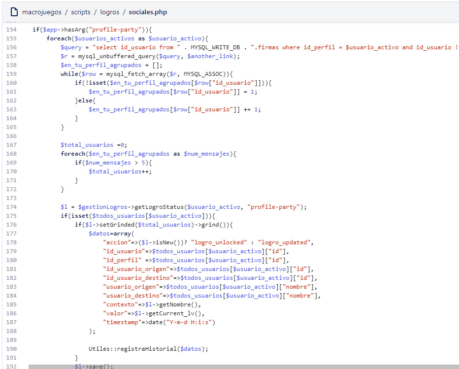
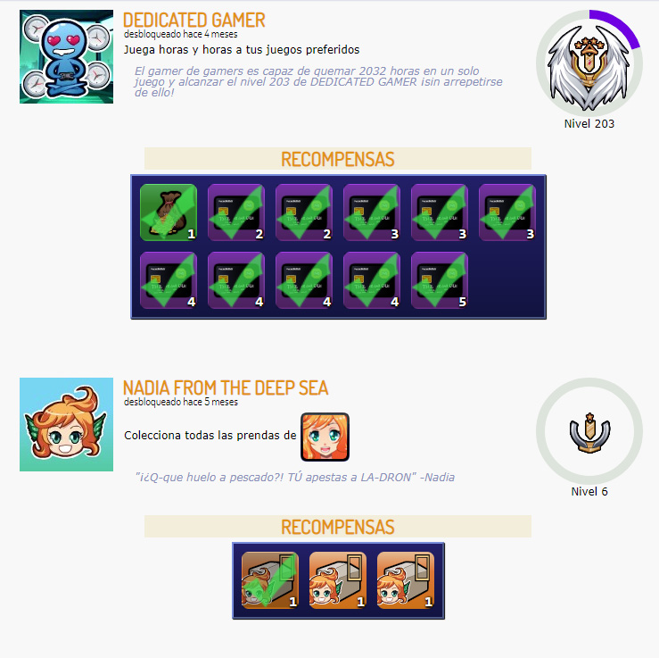
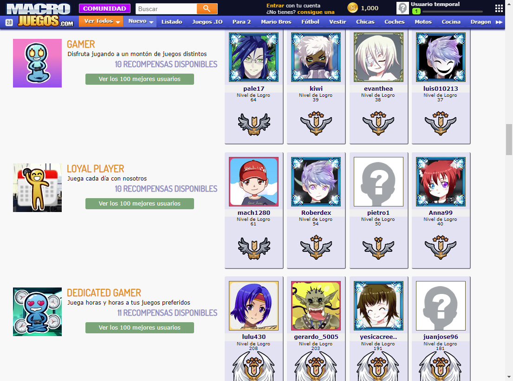
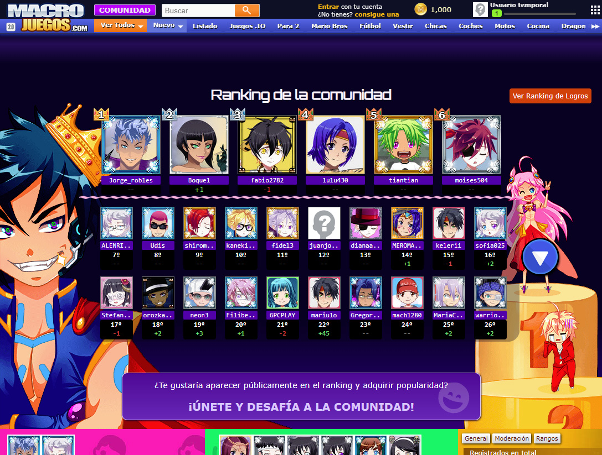

# How I built an achievements system for macrojuegos.com

I built this project with a team. We made an achievement system for [macrojuegos.com](http://www.macrojuegos.com/) and all the countries tld network. The users would receive achievements daily, based on their activity. Each achievement started as level 1 and could be grinded up to infinity. There were achievements for social interactions and achievements for playing games. Some achievements also gave rewards. The overall achievements earned would cast a special score that affected the top players from the community ranking.

## Dealing with data

This was the crucial step. We had to write a system of PHP code that managed SQL queries for each achievement. Once the data was consulted, for each user, the next step was performing the proper calculations and logic in order to discover which achievement level was worth. Save the achievement data for each user and send notifications.

*Profile party Achievement: Example code*

## Notifications

Special notifications for the achievements were made. Once a day if some of the achievements had an upgrade the users would be notified.

## Listing the user achievements in their profiles

A custom view had to be made with HTML CSS and JS in order to let the user check their achievements. They could also redeem the rewards available for some achievement tiers, which was either digital currency or digital assets, avatar clothes, etc.

*Private achievements and redeem rewards*

## Global achievement rankings

The proper PHP code and MySQL queries had to be created in order to prepare the global achievement rankings. Also, as for the frontend part we had to create the views using HTML and CSS like always.

*Global list with the best users for each achievement*

## Extra: Updating global rankings score

With the addition of achievements we made upgrades to the ranking algorithm, so the achievements score would be a big part of it.

## Conclusion

With all these gamification features our users had something else to do besides playing the games. They chose their own path, some went for grinding a particular achievement and become the number one. Some users just were happier because now they would get rewards for being just social (chatting with friends) without having to play games. More fun = more time in the website.