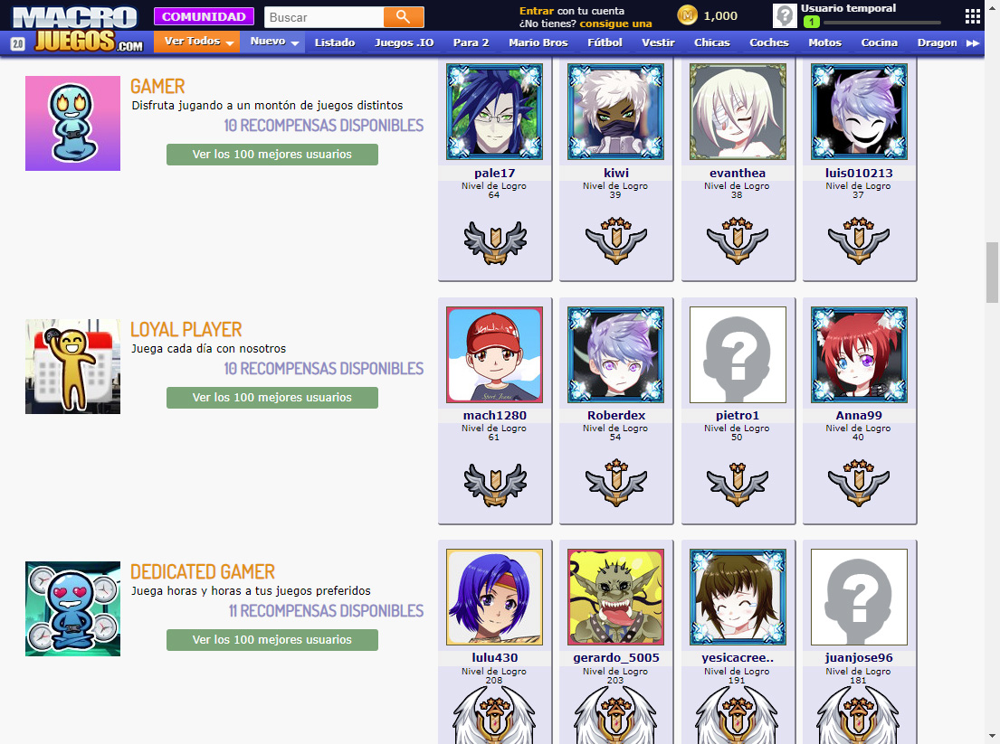
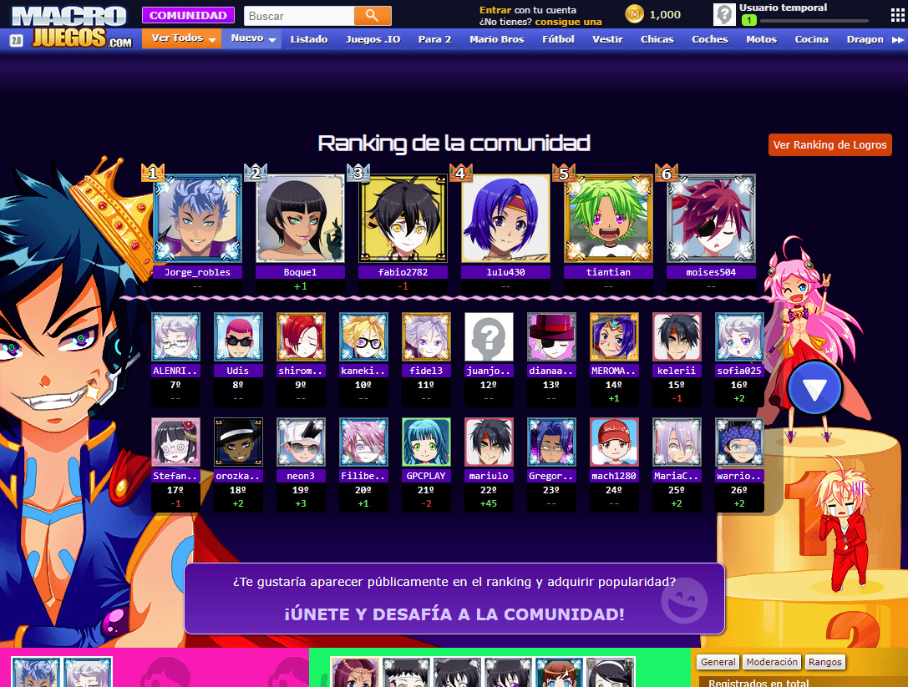

# Como construí un sistema de logros para macrojuegos.com

Construí este proyecto junto con mi equipo. Hicimos un sistema de logros para [macrojuegos.com](http://www.macrojuegos.com/) y toda la red de webs para otros países. Los usuarios recibían logros diariamente, basándonos en su actividad. Cada logro empezaba a nivel 1 y podía aumentarse de nivel hasta el infinito. Hay logros que hacen referencia a interacciones sociales y otros a logros por jugar a los juegos. Algunos logros también daban recompensas. El conjunto de logros conseguidos desembocaba una puntuación especial que afectaba a los mejores jugadores del ranking de comunidad.

## Tratando con datos

Éste era el paso más crucial. Tuvimos que escribir el código PHP del sistema y las consultas de SQL para cada logro. Una vez los datos eran recopilados, por cada usuario, el siguiente paso era hacer los cálculos y la lógica adecuada para descubrir cuál era el valor del logro. Guardar los logros en la base de datos e informar al usuario mediante notificaciones.

*Logro 'Profile Party': Código de ejemplo*

## Notificaciones

Se tuvieron que hacer notificaciones especiales para los logros. Una vez al día, si algunos de los logros eran mejorados, los usuarios serían notificados de ello.

## Listando los logros del usuario y sus perfiles

Se hizo una nueva vista con HTML, CSS y JS para mostrar a los usuarios cuales eran sus logros. Ellos podían también aceptar las recompensas disponibles para cada rango de logro, las cuales eran o bien moneda digital o bien objetos digitales, ropas para el avatar, etc.

*Logros privados y recompensas*

## Rankings globales de logros

Se tuvo que crear el código PHP y las consultas SQL necesarias para preparar el ranking global de logros. También, para la parte frontend, tuvimos que crear las vistas usando HTML y CSS como de costumbre.

*Listas globales con los mejores usuarios de cada logro*

## Extra: Actualizando la puntuación del ranking global

Con el nuevo sistema de logros ya en marcha, hicimos las actualizaciones pertinentes al algoritmo del ranking general. De este modo la puntuación de los logros sería buena parte de éste.

## Conclusión

Con todas estas mejoras de gamificación nuestros usuarios tenían algo que hacer además de simplemente jugar a los juegos de la web. Ellos elegían su propio camino, algunos decidieron trabajar para ser el mejor usuario de un logro concreto. Otros usuarios simplemente eran felices por que ahora recibían logros y recompensas simplemente por socializar por la web (chatear con amigos) sin tener que jugar a los juegos. Más diversión = más tiempo en la web.
