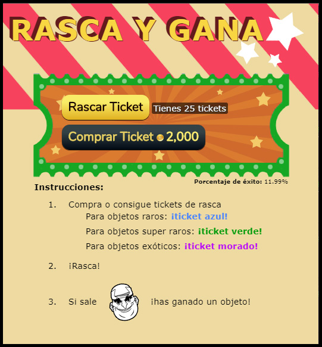

# Development of a scratch and win minigame with Unity

Panaworld asked me to create a scratch and win minigame. This project was so small that I could have used something else, like pure canvas and javascript.

We had a long run plan for creating more games with unity so we could export these to html5 or mobile native (IOS / Android). In order to learn the basics of Unity I decided to start with this small example project. Sadly I don't have code for this one because we replaced the game with some basic HTML, CSS, JS, etc. Our users didn't even want too play the scratch game, just get the rewards with a single click...

I consider myself a web developer not a game developer but in the past I've made a few unfinished games, playing around with tools like gamemaker studio, rpg maker or unity.