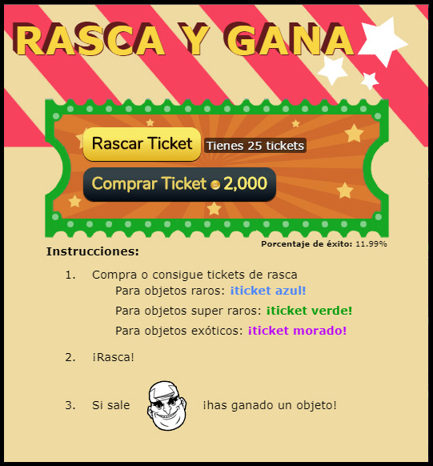

# Desarrollo de un minijuego tipo rasca y gana con Unity

La empresa Panaworld me pidió de crear un minijuego de Rasca y Gana. Este proyecto era tan pequeño que se podría haber creado con otra herramienta, como con puro javascript y canvas.

Teníamos un plan a largo plazo de crear más juegos con Unity y asi podríamos exportarlos a html5 o a nativo (IOS / Android). Para ir practicando con lo básico de Unity decidí crear este proyecto con esta herramienta. Desafortunadamente no tengo código que mostrar ya que reemplazamos este juego con otro creado con HTML, CSS, JS, etc. Nuestros usuarios no querían ni rascar, simplemente recibir la recompensa rápido con un solo clic...

Me considero un desarrollador web no un desarrollador de videojuegos pero si que es verdad que en el pasado he trasteado y creado muchos juegos no terminados, jugando con herramientas tipo gamemaker studio, rpg maker o unity.
