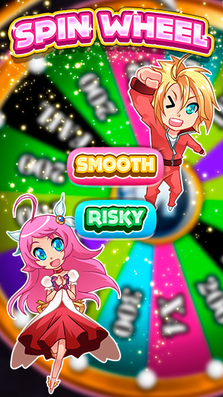

# Development of a spinwheel mobile game with Unity

Panaworld asked me to make some mobile games to embed them in the official macrojuegos app. While the app was being created by another developer, I was creating games to be played by our [macrojuegos.com](http://www.macrojuegos.com) user base using their smartphones.

Spinwheel was a special bonus game. This roulette could be played once a day, and our users could win some digital currency. It had two modes, one risky and normal. Risky means bigger prices but you could also win nothing. Normal ensures some small money. The point of the game was to make the users log in into our APP and see all the news.

*Unity is a game engine that uses C# as the scripting language*

*Youtube video showing the game being played*
`youtube:https://www.youtube.com/embed/1Cb6DeebPMM`

*Youtube video showing some code and GameObjects from Unity Engine*
`youtube:https://www.youtube.com/embed/BD2CY7r4arI`

This game was never released in public APP stores because the development of the macrojuegos APP was temporarily stopped in favor of another project.
