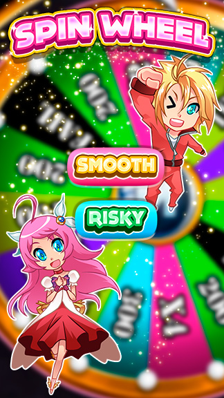
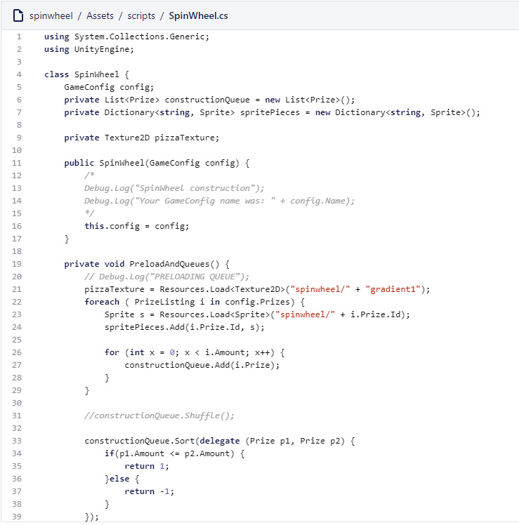

# Desarollo de un juego de ruleta con unity

Panaworld me pidió de hacer algunos juegos para móvil para incrustarlos dentro de la aplicación oficial de macrojuegos. Mientras otro compañero desarrollador estaba haciendo la aplicación, yo me dedicaba a crear los juegos que podrían ser jugados por los usuarios con cuenta en [macrojuegos.com](http://www.macrojuegos.com).

Spinwheel era un juego tipo bonus. Esta ruleta se podía jugar una vez al día y nuestros usuarios podrían ganar dinero virtual de la web con ella. Tenía dos modos de juego, arriesgado y normal. Arriesgado significaba mejores premios pero también podías ganar 0. Normal siempre daba un premio garantizado pero no solían ser demasiado buenos. La gracia del juego era que los usuarios logearan en la APP diariamente y así verían si hay novedades.

*Unity es un motor de juegos que usa C# como lenguaje de programación*

*Video de Youtube mostrando el juego siendo jugado*
`youtube:https://www.youtube.com/embed/1Cb6DeebPMM`

*Video de Youtube mostrando un poco de código c# scripts y gameobjects de Unity*
`youtube:https://www.youtube.com/embed/BD2CY7r4arI`

Este juego nunca fue publicado en las tienda de aplicaciones (PlayStore / AppStore) ya que tuvimos que parar el desarrollo de la aplicación para priorizar otros proyectos.
