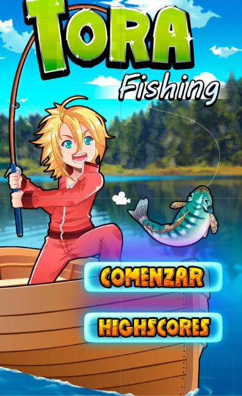
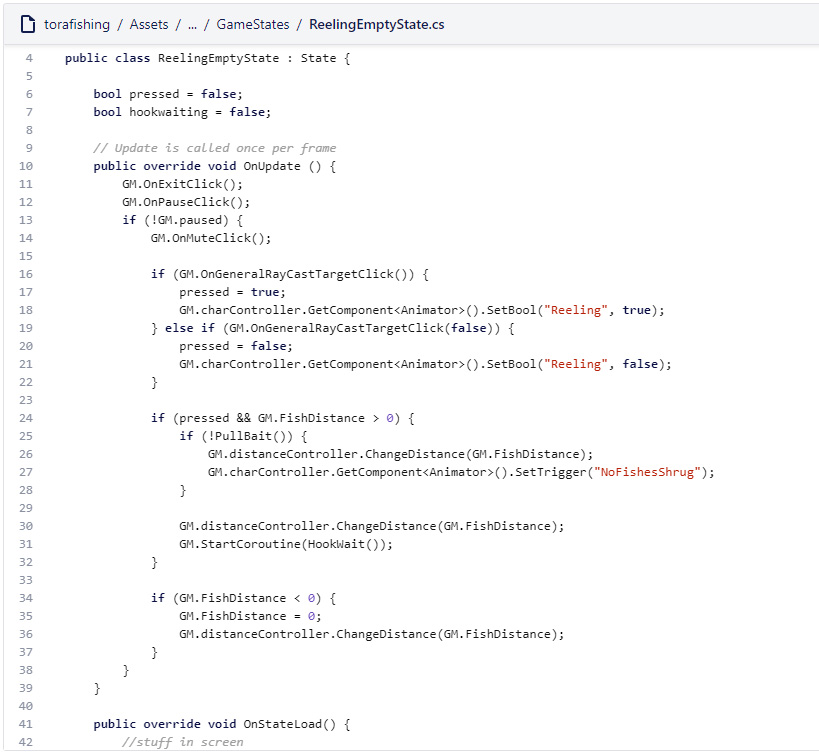

# Development of a fishing mobile game with Unity

This was my second unity game. Panaworld asked me to create mobile games for our future macrojuegos application. This a game where the user could use a popular character from the macrojuegos lore and fish with him. Fishing a lot of fishes or big ones lead to win some digital money. Our users could then use this money to buy digital assets like avatars, clothes or empowers.

*Unity is a game engine that uses C# as the scripting language*

*Watch the gameplay demo in Youtube*
`youtube:https://www.youtube.com/embed/9JO1RZEbntw`

*Some code visible in this video*
`youtube:https://www.youtube.com/embed/L6oOpU37C28`

This game was never released in public APP stores because the development of the macrojuegos APP was temporarily stopped in favor of another project.
