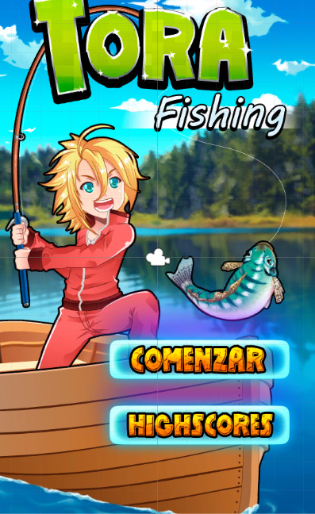
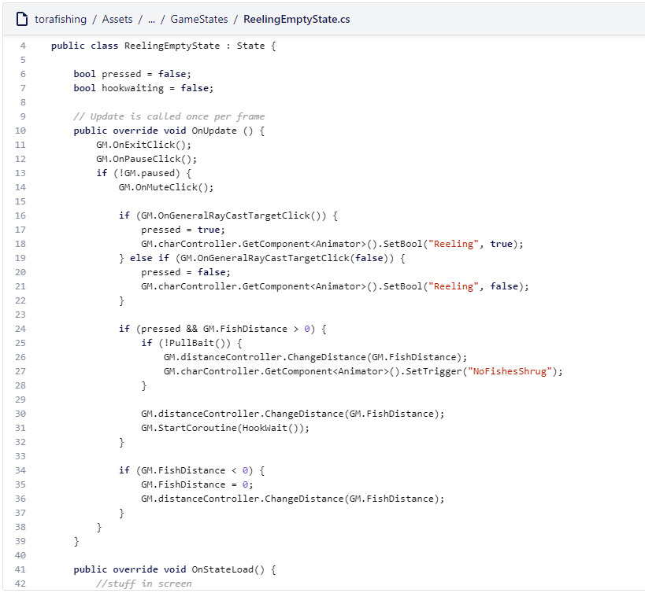

# Desarrollo de un juego de pesca para móviles con Unity

Este era mi segundo juego creado con Unity Engine. En Panaworld me pidieron de crear juegos de móvil para la futura aplicación de macrojuegos. En este juego el usuario podría jugar con un personaje popular del universo de macrojuegos.com y pescar con él. Pescando muchos peces o peces muy gordos te permitía ganar dinero digital. Los usuarios comprarían objetos digitales, ropa para su avatar y super poderes con este dinero.

_Unity es un motor de juegos que usa C# como lenguaje de programación_

_Mira un poco de gameplay en Youtube_
`youtube:https://www.youtube.com/embed/9JO1RZEbntw`

_Algo de código visible en este video_
`youtube:https://www.youtube.com/embed/L6oOpU37C28`

Este juego nunca fue publicado en las tiendas de aplicaciones principales ya que el desarrollo de la aplicación principal de macrojuegos.com fue pausado temporalmente en favor de otro proyecto.
