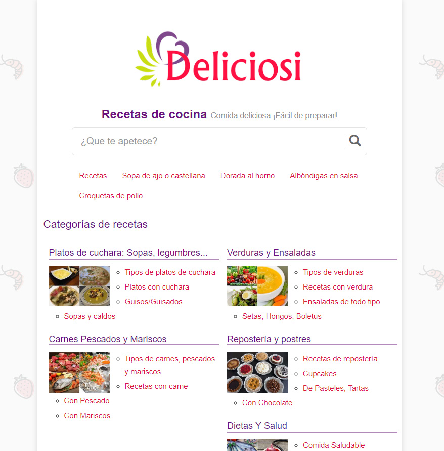

# Project planning for Deliciosi.com

Our CEO decided to start new SEO friendly project in a market other than the browser videogames. He was determined and he chose the food / recipes market. He asked me to supervise the viability for this project first and plan along.

## Reunion with CEO for budget and timelines

We had to properly plan things like our deadline and talk about how many people would be required, technical, content managers, pick freelancers, who would manage them, etc. We also decided to perform a full SEO analysis first in order to see the viability of the project.

## Full SEO Analysis

I started performing a deep SEO analysis, doing things like keyword research, checking out rank difficulty for each one, etc. I used google drive spreadsheets to prepare a content creation plan in the proper order and let our content manager know what keywords should be included.

### Project difficulty

My conclusion was that this market was just too big and too hard for us. Plenty dominant websites with more than 10 years of links. A lot of small websites, bloggers usually, picking up some of the longtail traffic. And the worst, the users preferences were watching recipes on Youtube (of course).

I told our CEO about my research and he decided to give it a shot anyway.

## Performing competitive analysis

In order to have an idea of how difficult would be to match our competitor features, so users would prefer us, we required to check all the competitors, the old and the new. I was in charge of this, writting down the features, some new ideas no one else did so far, what features would be MVP so the site could be deployed and online as fast as possible, what features would be the long term scalability (things like users for example), etc.

## Reunion and planning with our technical team

We planned what technologies could be used for the project. Checked new technologies, checked our deadlines and decided our action plan. We distributed the work properly and filled our Product Logs and TODO lists. Our final decision was to use our custom PHP framework for backend and tools like Boostrap to make Frontend responsive development faster. Later, we found out that using bootstrap was not the best idea because we required to integrate AMP pages (Google technology), and bootsrap was an issue in our way to create them. The solution was to manage all the SASS code ourselves and reduce bootstrap features to a minimum.

## The end product

The product is [https://www.deliciosi.com/](https://www.deliciosi.com/), a seo optimized full responsive website. I have no idea if this will be still online at the moment you check the link so I leave some screenshots below.

*Home recipe list*

*Search recipes*

*Categories*

*Recipe page*

*Angular 2 Control Panel*

