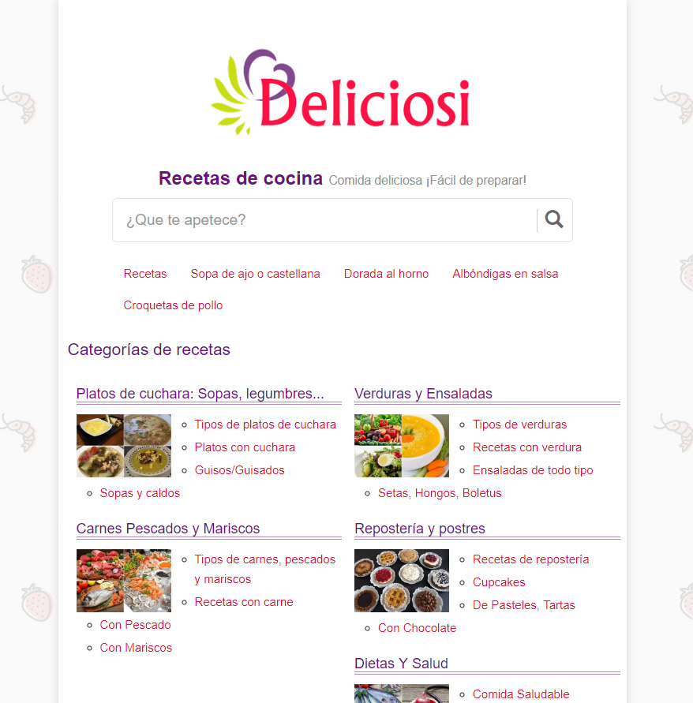
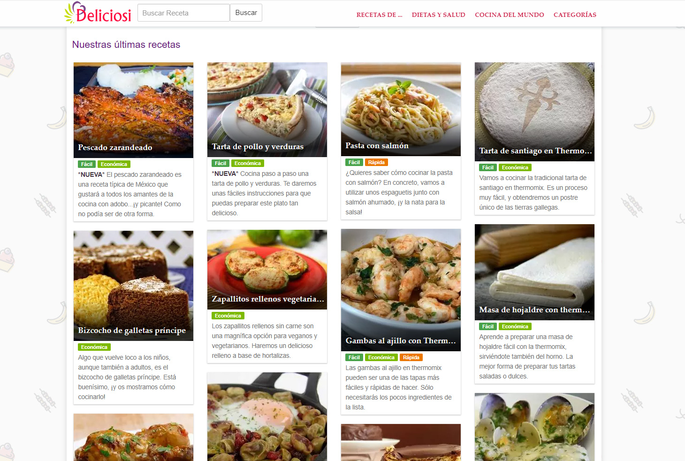
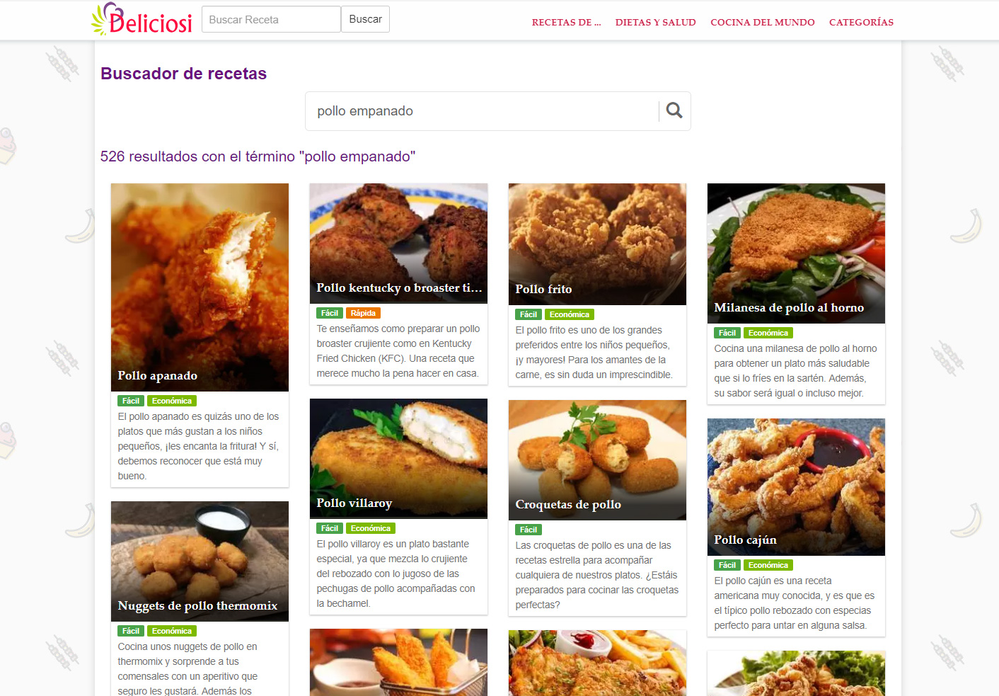
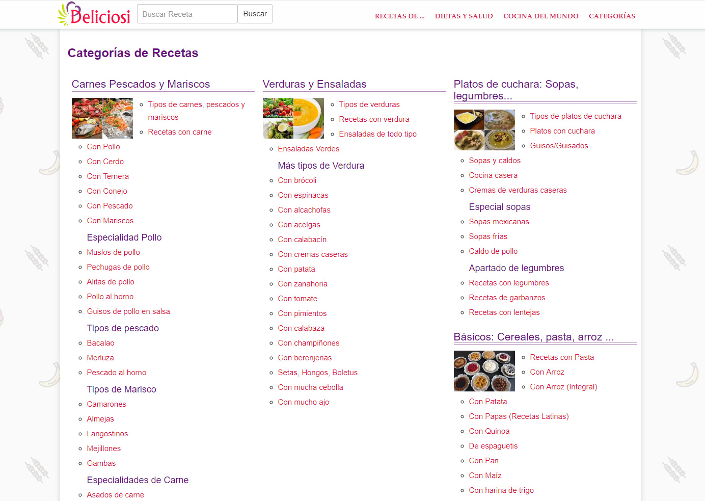
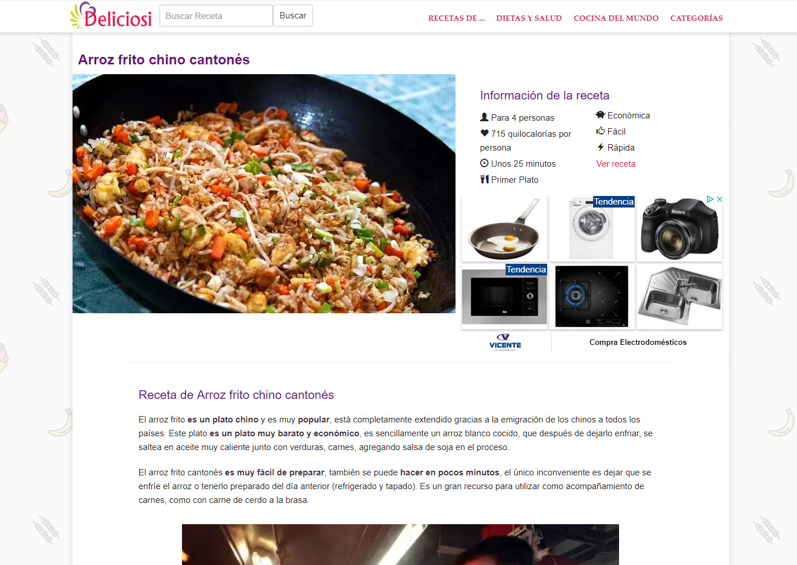
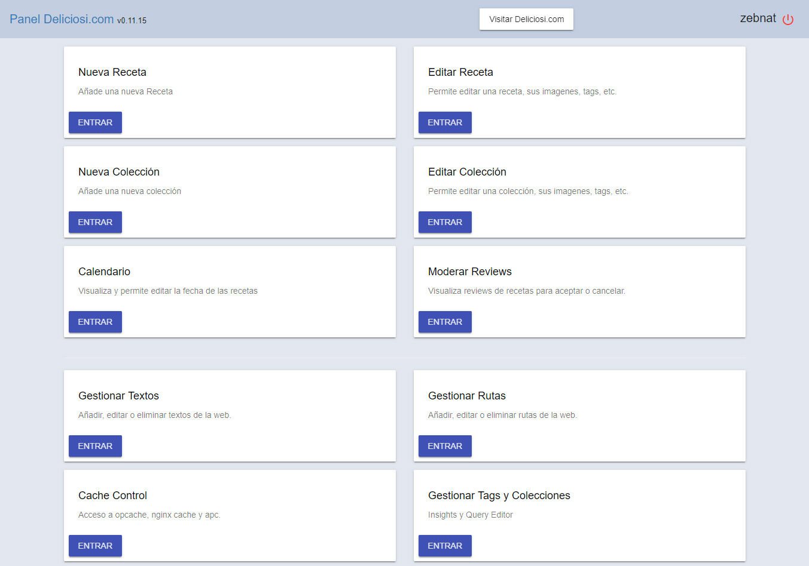

# Planificación del proyecto Deliciosi.com

Nuestro CEO decidió comenzar un nuevo proyecto SEO en un mercado distinto a los videojuegos de navegador. Tenía mucha determinación por el nicho de las recetas y la comida. Me pidió supervisar la viabilidad del proyecto y planificar lo que fuera necesario.

## Reunión con el CEO para tiempos y costes

Tuvimos que planificar bien cosas como cual sería la fecha límite y hablar de cuanta gente participaría en el proyecto, técnicos, creadores de contenido, freelancers, quién controlaría a estos últimos, etc. Decidimos hacer un analisis SEO completo primero para ver si sería un proyecto viable o no.

## Análisis SEO completo

Empecé a realizar análisis SEO al mercado y a la competencia, recopilar palabras clave, comprobar la dificultad para salir en los primeros resultados de cada una de estas, etc. Utilicé hojas de cálculo en Google Drive para preparar la planificación del contenido en el orden de creación más óptimo y dejar que los creadores de contenidos tuvieran algo con lo que trabajar.

### La dificultad del proyecto

Mi conclusión final fue que este nicho de mercado era demasiado grande y difícil para nosotros. Habían demasiadas webs grandes arropadas por grandes marcas y que llevaban ya más de 10 años en el sector acumulando enlaces. También habían un montón de webs pequeñas, generalmente blogs, y estos absorbían mucho tráfico longtail. Lo peor, los usuarios estaban cambiando de preferencias y estaba viendo una tendencia a crear contenidos de recetas en Youtube.

Avisé al CEO de que iba a ser difícil y que de acaparar las primeras posiciones sería en palabras clave poco competidas y decidió tirar para adelante.

## Analizando a la competencia

Para tener una idea de como de difícil sería igualarnos a nuestra competencia, y así los usuarios nos preferirían, tuvimos que comprobar a toda la competencia, los antiguos y los nuevos. Me puse a ello, escribiendo todas las características que tendría la web, algunas nuevas ideas que nadie había implementado todavía, cuál de éstas haríamos primero en la versión MVP y así sacar la web online lo antes posible, que características serían más para largo plazo (como red social de usuarios interna), etc.

## Reunión con el equipo técnico

Con los técnicos programadores planificamos que tecnologías podríamos utilizar para este proyecto. Comprobamos algunas de las nuevas tecnologías, comprobamos nuestra fecha límite y decidimos el plan de acción. Distribuímos el trabajo adecuadamente y rellenamos nuestro 'Product Log' y nuestras listas TODO. Nuestra decisión final fue utilizar el Framework PHP que hicimos en la empresa para el backend y herramientas nuevas como bootstrap para el frontend, para hacer así más rápido el desarrollo de éste. Más tarde vimos que utilizar bootstrap no fue la mejor de las ideas ya que queríamos integrar AMP Pages (tecnología de Google) y bootstrap era un muro en el camino para usarlo. La solución fue tratar con el código fuente de bootstrap manipulando manualmente todos los archivos SASS y limitando la mayor parte de código que fuera posible para reducir su tamaño.

## El producto final

El producto final es [https://www.deliciosi.com/](https://www.deliciosi.com/), una web optimizada para SEO, muy rápida y con diseño responsive. No tengo ni idea de si la web estará en pie en el momento de visitar este link asi que dejaré algunas capturas más.

*Lista de recetas, página principal*

*Buscador de recetas*

*Categorías*

*Página de la receta*

*Panel de gestión Angular 2+*

