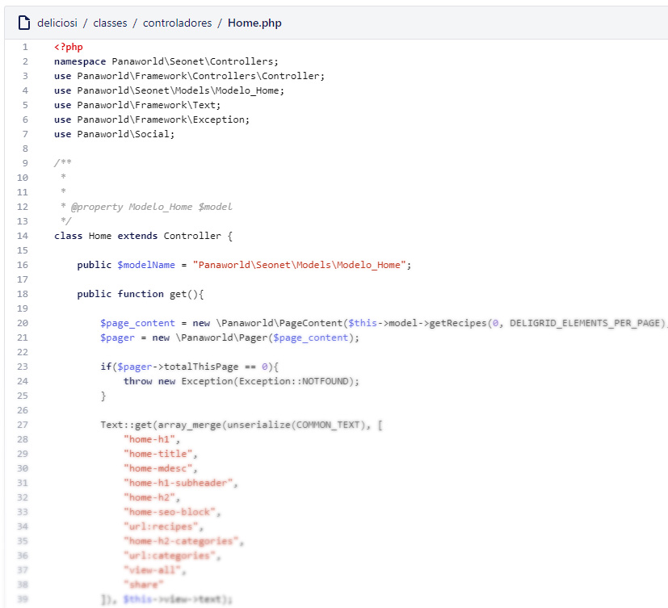
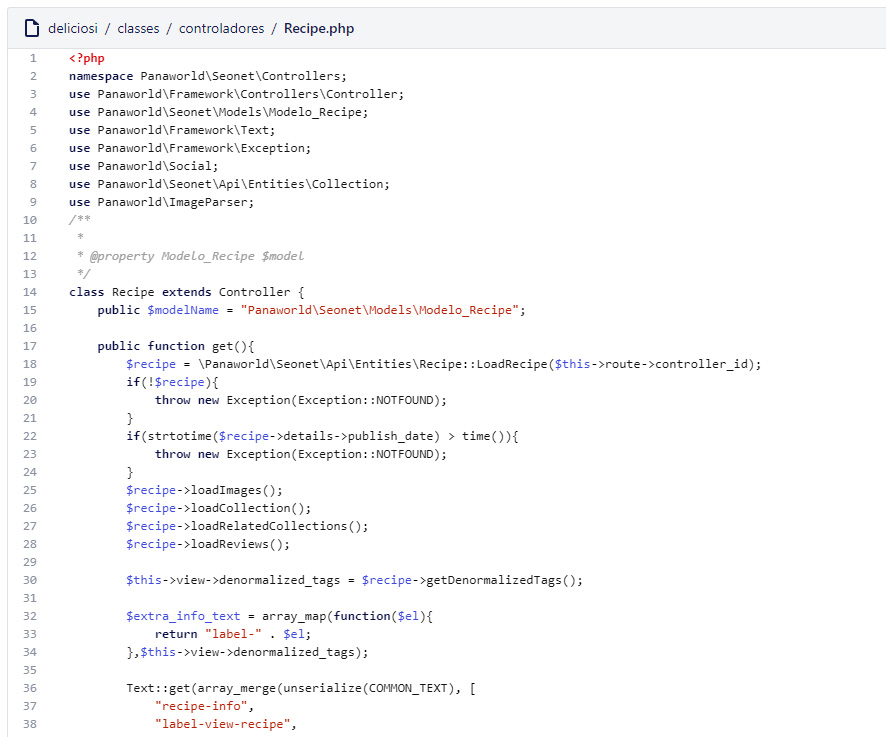
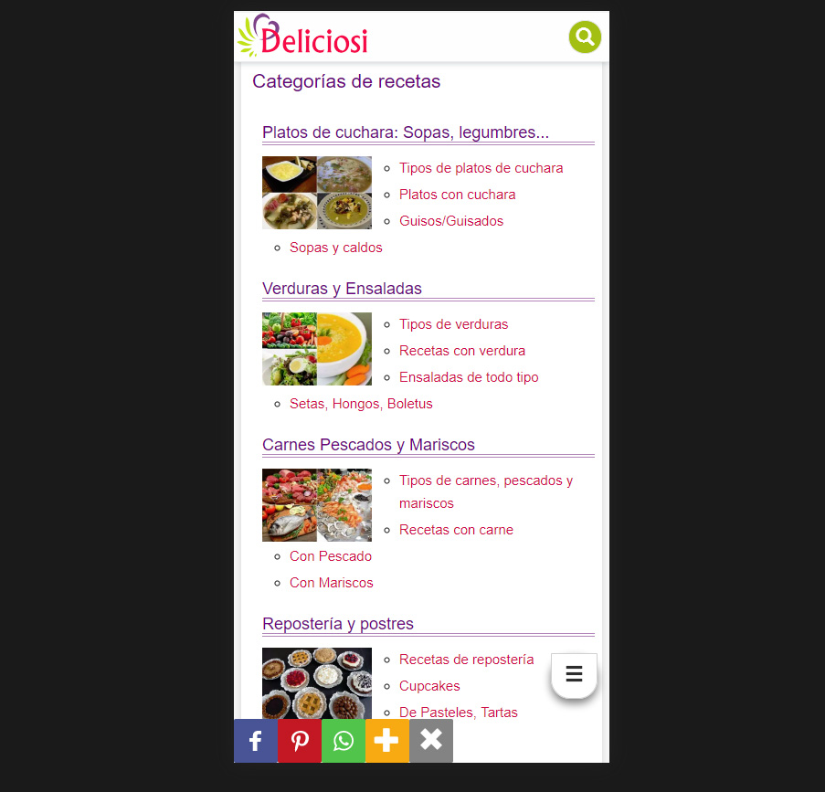

# Backend and Frontend development for deliciosi.com

While the other members of the team focused on the angular control panel and were busy tweaking the framework or the thumbnail system I was responsible of developing the frontend and the backend business logic code by creating controllers, models and views.

## Deliciosi Frontend work

Using bootstrap I started to create the view layouts, handling LESS code manually. They were fully responsive, so they were optimized both for mobile and desktop screens. Some javascript was also required for the site, mostly jQuery for bootstrap plugins but also some custom functions.

View layouts created using Bootstrap HTML in PHP:

* Header
* Footer
* Navigation menu
* Social module
* Collection image Grid (Deligrid)
* Pager
* Recipe page
* Home page
* Categories Page
* Search Page
* Collection Page
* Legal page
* 404 Page
* Sitemaps

*Views php code structure example*

## Deliciosi Backend work

Using PHP and our custom Framework I created the configurations, routes, controllers, models, performed SQL queries, prepared the variables for the views and rendered them for each route.

*(Backend) Controller code example*

*(Backend) Some functions involved in Search*

## End product

A food recipes responsive website optimized for performance and SEO with AMP Pages support. You can visit the site in [https://www.deliciosi.com/](https://www.deliciosi.com/).

If the site is offline or you want to know more about the project just visit [deliciosi project plan and management](/en/projects/deliciosi-project-plan-and-management/).

