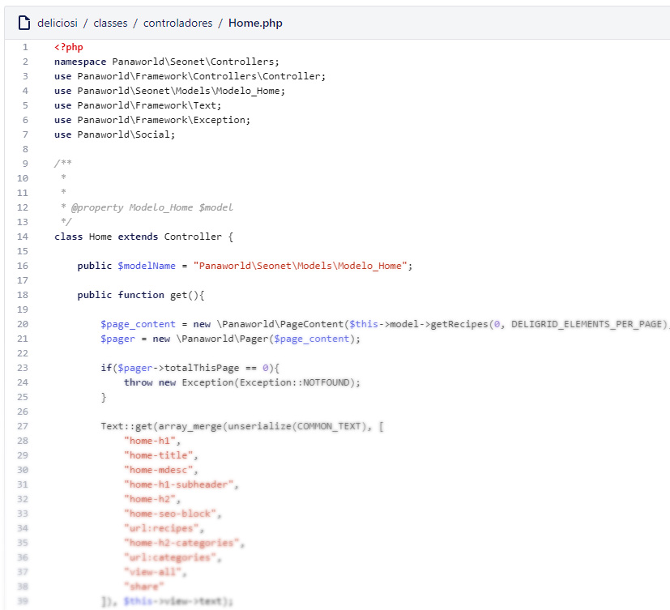
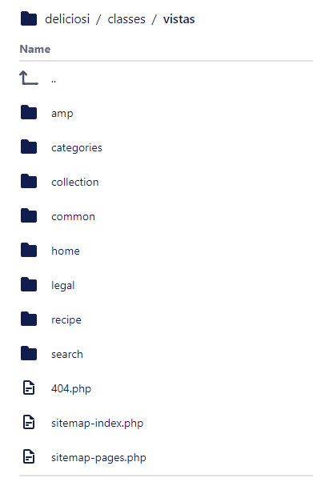
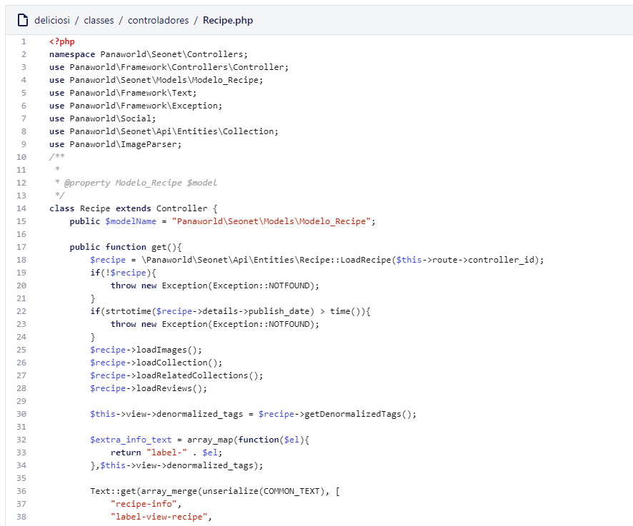
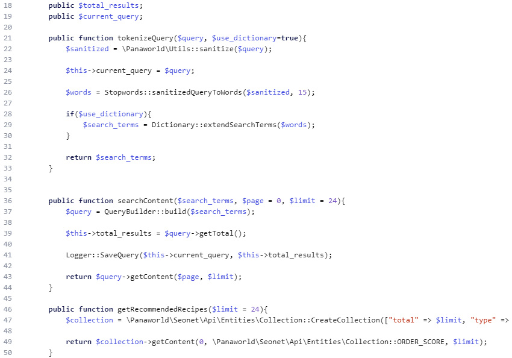
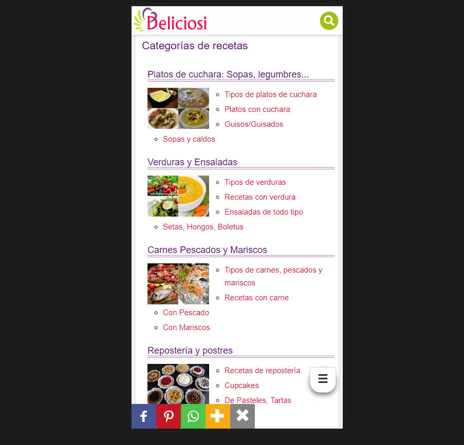

# Desarrollo del Backend y Frontend de deliciosi.com

Mientras otros miembros del equipo estaban haciendo el panel de control de contenidos o arreglando cosas del framework o el sistema de thumbnails, yo tuve que desarrollar el código frontend y backend, creando controladores, modelos y vistas.

## Código Frontend de Deliciosi

Utilizando bootstrap empecé a crear los diseños/maquetación de las vistas, tratando el código LESS manualmente. Eran completamente responsive, es decir optimizados para pantallas de móviles, tablet, o desktop. También se tuvo que meter algo de javascript, mayormente jQuery por los plugins de bootstrap pero también otras cosas concretas.

Vistas creadas utilizando bootstrap y html en PHP:

* Cabecera
* Pié de página
* Menú de navegación
* Módulo social
* Deligrid, colección de imágenes
* Paginador
* Página de receta
* Página principal
* Página de categorías
* Página de buscar
* Página de colección
* Página de temas legales
* Página 404
* Sitemaps

*Código php de vistas, estructura de archivos*

## Trabajo backend en deliciosi

Utilizando PHP y nuestro Framework casero me dispuse a crear las configuraciones, rutas, controladores, modelos, consultas de SQL y preparar las variables para renderizar las vistas de cada ruta.

*(Backend) Código de ejemplo controlador*

*(Backend) Algunas funciones para el buscador*

## Producto final

Una web de recetas de cocina completamente responsive optimizada para tener alto rendimiento y para el SEO, con soporte AMP pages. Puedes visitarla en [https://www.deliciosi.com/](https://www.deliciosi.com/).

Si el sitio está offline o quieres conocer más sobre el proyecto puedes visitar el [proyecto de planificación de deliciosi](/proyectos/planificacion-de-proyecto-deliciosi/).

