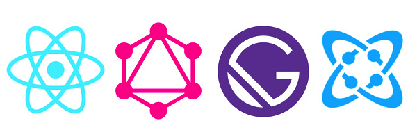

# Mi web personal creada con React



Probablemente vayamos a hablar del mismo sitio que estás visitando en estos momentos. Decidí crear mi propio sitio web utilizando tecnologías como Reactjs. El problema era que React es una herramienta frontend y la web, especialmente si te importa el SEO, demanda que se renderice el html desde el servidor en cada petición. Encontré tres soluciones para este problema:

* Crear mi propio server en nodejs y reutilizar mis componentes React para el Frontend y el Backend (Universal) utilizando ReactDOMServer RenderToString en el servidor para el problema del SEO
* Probar [gatsbyjs](https://www.gatsbyjs.org/) una herramienta/framework open source basado en React que ayuda a los desarrolladores a crear webs ultra rápidas y aplicaciones
* Probar [nextjs](https://nextjs.org). Una herramienta que te permite crear sitios web usando React y teniendo también server rendering, static export, etc

Ambos, gatsbyjs y nextjs, son herramientas muy parecidas pero _elegí gatsby_ por que me pareció más conveniente y productivo y también por que iba más adelantado en características que su competidor nextjs.

## Bueno, y que es gatsbyjs

Con Gatsby, escribes componentes [React](https://reactjs.org) como si fueses a crear una SPA (single page app). Tienes 'hot reloading' para hacer el desarrollo más fácil al igual que con [create react app](https://facebook.github.io/create-react-app/docs/getting-started). Es una herramienta categorizada como [JAMstack](https://jamstack.org/). Básicamente tú escribes componentes React, puedes gestionar las rutas simplemente creando carpetas en tu proyecto o utilizando la API correspondiente para ello. Puedes generar múltiples páginas automáticamente utilizando componentes React como template y  la API de [Gatsby Node](https://www.gatsbyjs.org/docs/node-apis/).

Al final obtendrás un montón de archivos estáticos generados por la herramienta que son muy fácil de poner en un servidor, cdn o servicio cloud. La web será muy rica en dinamismo frontend ya que la has contruido utilizando React y todos sabemos lo productivo que es. No necesitas backend, solo necesitas un 'Headless CMS' si quieres que el contenido sea creado por personas no técnicas, de otro modo puedes utilizar sencillamente archivos markdown como hice yo para este sitio.

### Espera... Headless CMS?

Puedes tener un CMS como Wordpress, crear contenido en él y dejar que Gatsby agarre los datos de él y haga el trabajo por tí. Terminarás teniendo una web muy rápida, segura, que escala con react y muy seofriendly que además no requiere PHP ni es vulnerable a problemas de seguridad de Wordpress. Muy conveniente.

Algunos headless CMS que puedes usar son [Contentful](https://www.contentful.com/) o [Strapi](https://strapi.io) pero puedes usar wordpress también si quieres, o tu propio CMS si expones una api pública y haces un plugin para que gatsby sepa como pedirla.

### El ecosistema de plugins de Gatsby

Gatsby te ofrece un ecosistema de plugins que es muy conveniente y útil. Por ejemplo si tu quieres utilizar wordpress como tu fuente de datos solo necesitas instalar y configurar el plugin [gatsby-source-wordpress plugin](https://www.gatsbyjs.org/packages/gatsby-source-wordpress/). Hostea tu wordpress donde sea (puedes tenerlo hasta en una intranet de la oficina) y usa la config del plugin para conectarlo con gatsby. Gatsby utilizará la API rest de wordpress para pedirle los datos que has metido en éste. Hay muchos plugins para cualquier cosa por ahí, es muy productivo para los desarrolladores.

### GraphQL

[GraphQL](https://graphql.org/learn/) es un lenguaje para hacer consultas a APIs, un reemplazo o altenativa a REST. Si quieres utilizar Gatsby mas te vale aprender como hacer consultas graphql. No es difícil pero puede ser confuso al principio. El verdadero problema es cuando tienes que implementar graphQL en un servidor para ofrecer un API pero en este caso Gatsby es el que hace de "server" ahorrandote el trabajo.

*Ejemplo de consulta Graphql*

```graphql
graphql`
query {
  site {
    ...SiteMetadata
  }
  allMetaData(filter: { currentLang: { eq: "es" } }) {
    ...MetaData
  }
  allMenu(filter: { lang: { eq: "es" } }) {
    ...Menu
  }
}
`
```


### Usando 'CSS in JS'

Otra palabrita nueva que se oye hoy en día. Se trata de una herramienta que permite escribir CSS en los mismos componentes. En este caso en React, de la siguiente manera:

```js
    <Link
        css={{
            color: '#3b6cc5',
            background: '#ecf3ff',
            padding: '6px 10px',
            borderRadius: 2,
            fontWeight: 'bold',
        }}
        to={path}
    >
        {readMoreText}
    </Link>
```

En este ejemplo estoy usando [glamor](https://github.com/threepointone/glamor), te permite escribir objetos js como si fueran propiedades de css pero has de convertirlas a camelCase.

No debes preocuparte ya que el css no irá inline, sino que se crearán automáticamente nombres de clase y el css terminará en su propio documento de forma que estará optimizado de manera automática. Genial...

## Dockerizando un sitio web gatsby

Gatsby genera archivos estáticos así que un simple rsync a un servidor o servicio cdn sería suficiente. Aun así, me hice un Dockerfile para contruir una pequeña imagen de Alpine linux con un nginx. Instalé node, gastby, git, un `git pull` a github y buildear con gatsby es todo lo que necesitas para tener tu sitio siendo servido por nginx. Muy cool y portable pero un poco overkill xD

## Conclusión

Esta web es una PWA o página web progresiva. Renderiza muy rápido gracias a venir el render del servidor (que podría ser un CDN). Utiliza [React hydrate](https://es.reactjs.org/docs/react-dom.html#hydrate) para permitirte navegar por todo el sitio utilizando javascript, haciendo pre-cargas de las páginas sin que tú lo veas y así te cargará todo super rápido, es increíble.

Recomiendo a cualquiera migrar sus sitios wordpress o crear sus nuevas webs con gatsby o nextjs. Si, perderás el ecosistema de plugins de Wordpress pero recibirás a cambio un montón de velocidad, seguridad y también ahorrarás dinero hosteando la web. Para ser sincero puedes hacer cualquier tipo de web hoy en día con gatsby.

## ¿Se puede ver el código?

Tienes suerte, este proyecto es open source, hice un repositorio en github así que le puedes [echar un vistazo](https://github.com/zebnat/ddev-gatsby).

[https://github.com/zebnat/ddev-gatsby](https://github.com/zebnat/ddev-gatsby)
