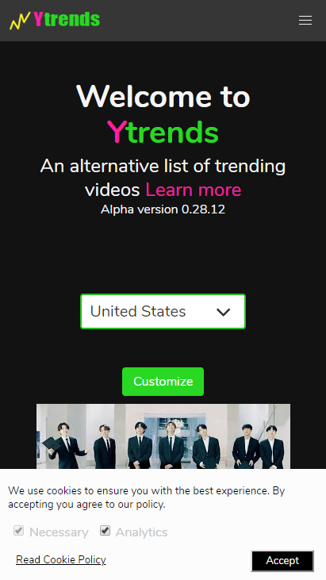
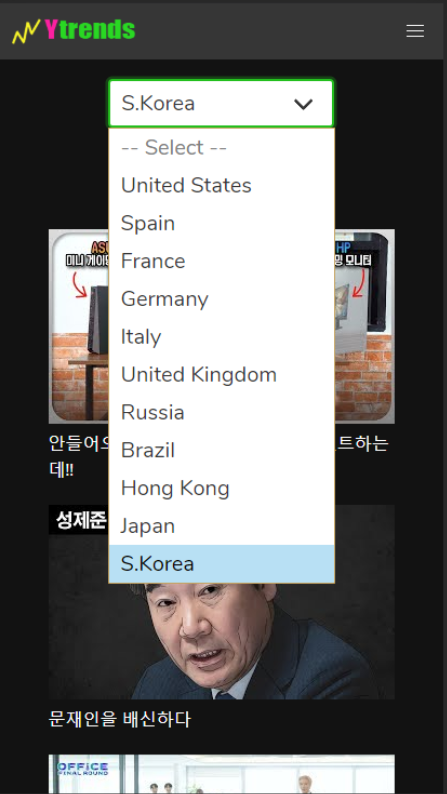
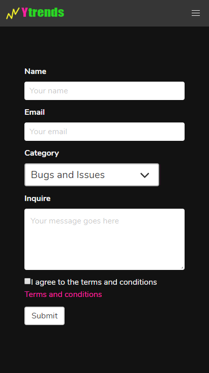
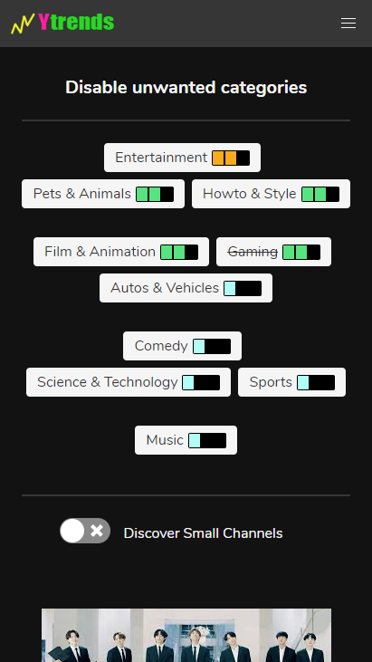
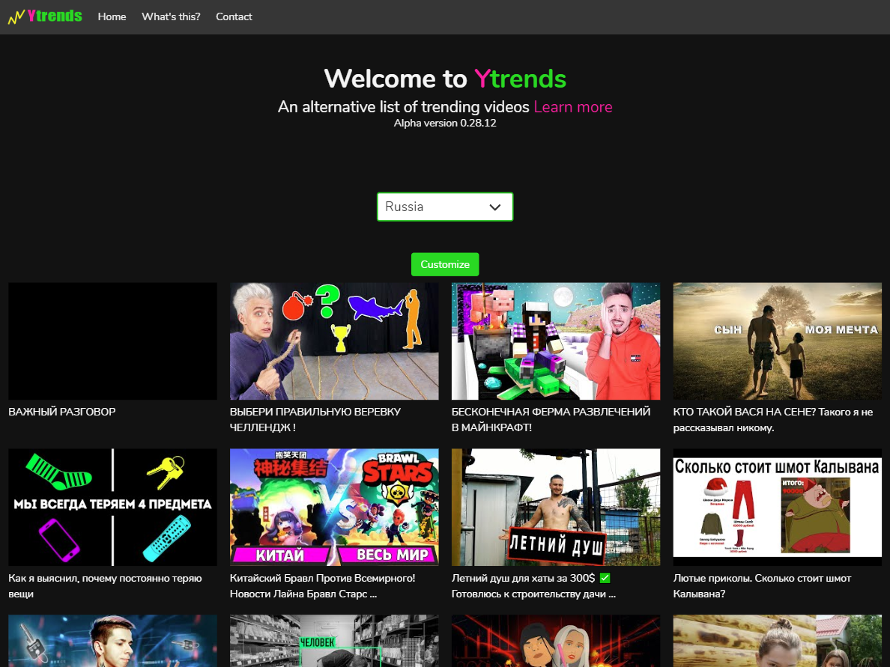
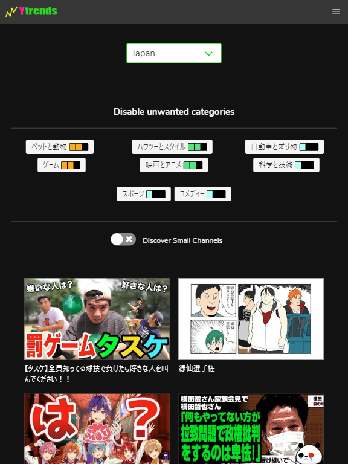
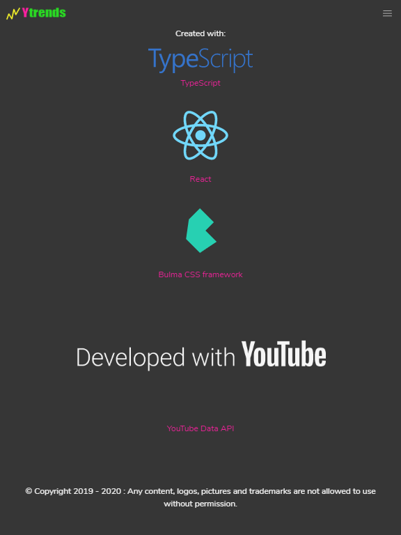

# An alternative for Youtube trends

When it comes to side projects I'm always looking for something useful to build. Usually useful for me, but maybe also useful for other people. I created Ytrends because the Youtube oficial trends algorithm sucks (personal opinion).

The project is no longer hosted and online, but you can still deploy it using [the repository](https://github.com/zebnat/videotrends-alternative).

## Screenshots Demo

### Mobile Home

### Algorithm generated for different countries

### Contact form that uses Firebase storage as backend

### Remove unwanted categories from your resultset

### Laptop mode Russia content

### Korean content under mobile

### Japan under tablet

### Technologies used

## Technical aspect

The project was made with typescript. It has a typescript + react + bulmacss frontend. The backend is just a script, also created with typescript. It uses the Youtube Api and some math to create a new trends algorithm.

A Docker container serves the backend and updates the videos daily.

Use of Firebase free tier for serverless contact form storage.

## Disclaimer

The project depends on the Youtube Api and we all know that Google likes to discontinue their things so I cannot guarantee that this project will be alive forever.

## Show me the code

This project is open source, I made a github repository so you can [explore it](https://github.com/zebnat/videotrends-alternative).

[https://github.com/zebnat/videotrends-alternative](https://github.com/zebnat/videotrends-alternative)
