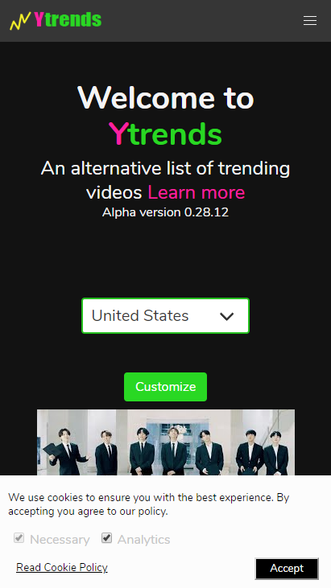
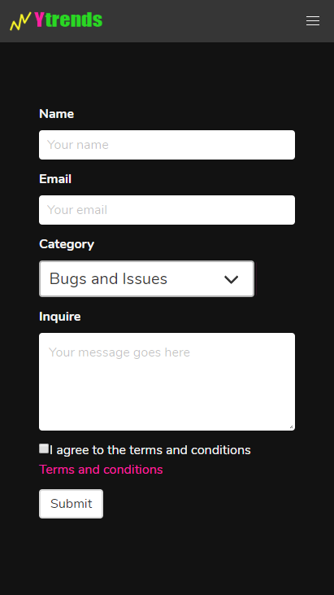
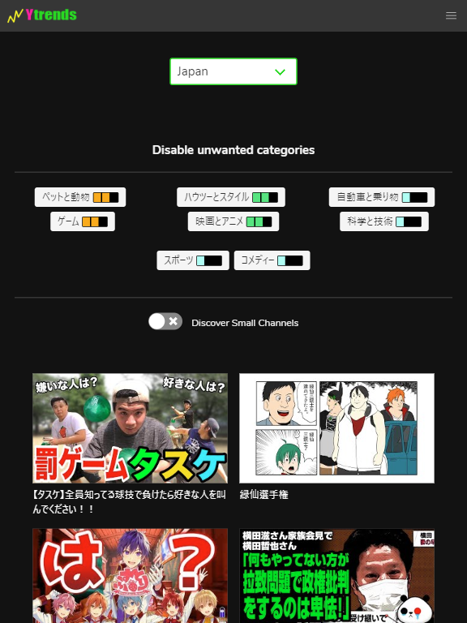
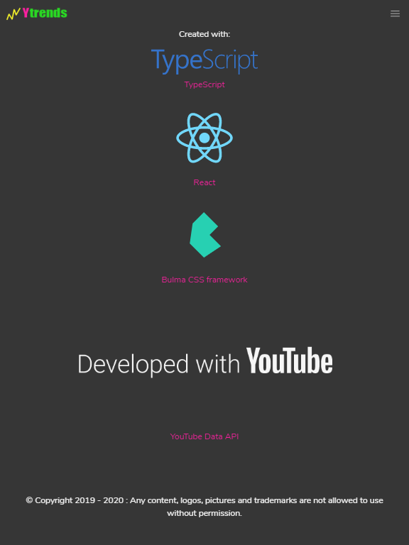

# Una alternativa a las tendencias de Youtube

Cuando se trata de proyectos personales siempre intento hacer algo útil. Normalmente útil para mí pero también puede serle útil a otro. Creé este proyecto por que el algoritmo oficial de las tendencias de Youtube es un poco raro, me da la impresión que ponen lo que le interesa poner a Youtube.

El proyecto ya no está online y visible pero todavía puedes hacerle deploy usando el [repositorio de github](https://github.com/zebnat/videotrends-alternative)

## Screenshots Demo

### Página principal en móviles

### Algoritmo generado para diferentes países

### Formulario de contacto usa Firebase como backend

### Elimina las categorias no deseadas

### Contenido ruso en vista de portátil

### Contenido koreano en movil

### Contenido japonés en tablet

### Tecnologías utilizadas

## Aspecto técnico

Este proyecto se creó con typescript. Tiene un Frontend apoyado en typescript + react + bulmacss. El backend es tan solo un script, también hecho con typescript, que utiliza la api de Youtube y algo de matemáticas para crear un nuevo algoritmo.

Un contenedor Docker se encarga del backend y de actualizar los videos diariamente.

Uso de Firebase para almacenar el formulario de contacto.

## Disclaimer

El proyecto depende de la Api de Youtube y todos sabemos que google suele descontinuar sus inventos asi que no puedo garantizar que viva eternamente.

## Muéstrame el código

El proyecto es open source, hice un repositorio en github asi que puedes [visitarlo](https://github.com/zebnat/videotrends-alternative).

[https://github.com/zebnat/videotrends-alternative](https://github.com/zebnat/videotrends-alternative)
